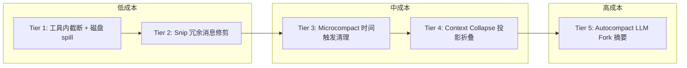
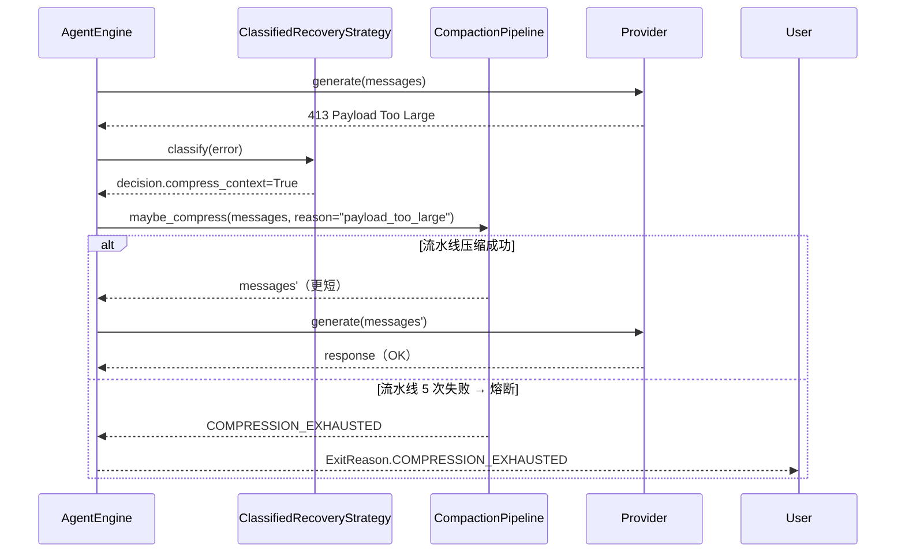
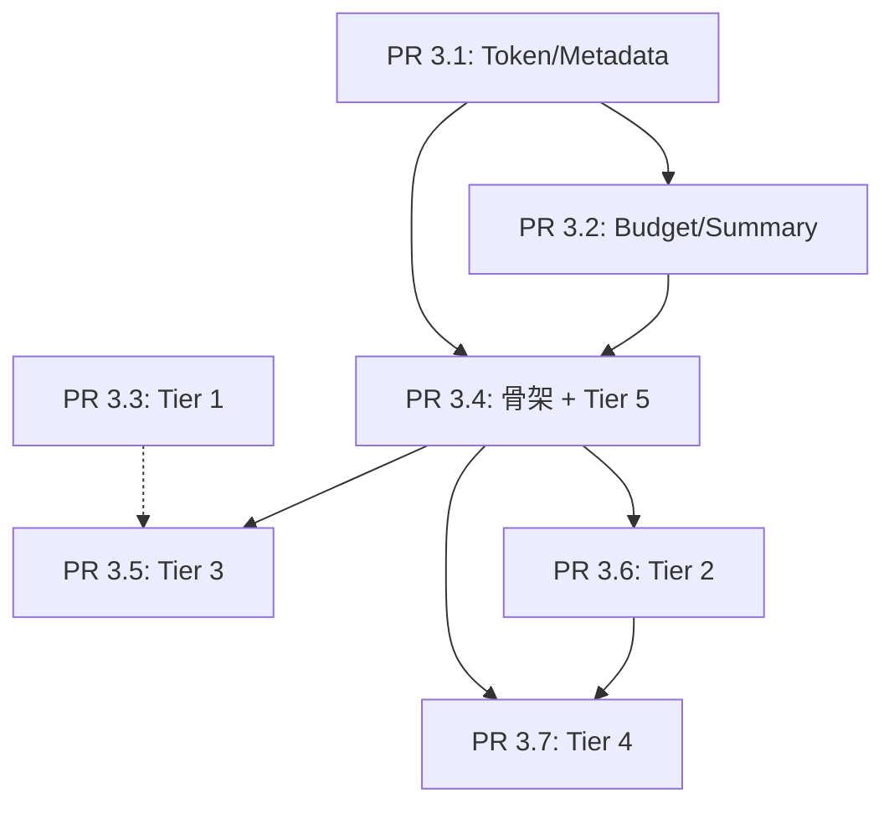

# Sprint 3 总览 — 五级上下文压缩流水线

## 一、为什么要重新设计 Sprint 3

### 1.1 原计划的局限

[`07_sprint_execution_plan.md`](../run-loop-roadmap/07_sprint_execution_plan.md)
原本把 Sprint 3 的 P1-1（上下文压缩抽象）规划为**单层 SummarizingCompressor**：

> SummarizingCompressor：保留 protect_first_n + protect_last_n 不动；
> 中段调用一次 LLM `summarize(messages_middle) -> str`，替换为单条 system
> "Earlier conversation summary: ..."。

这个方案的工程问题：

1. **粒度过粗**：所有压缩走同一条 LLM 路径，无论是冗余 read_file 调用还是巨量历史。
2. **成本失控**：每次压缩都要发一次 LLM 请求，10 轮内可能触发 3-5 次。
3. **不可降级**：单层失败就只能 abort 整轮（`COMPRESSION_EXHAUSTED`）。
4. **与 prompt cache 冲突**：直接重写消息会让 Anthropic prompt cache 全部失效。

### 1.2 claude-code 的工程哲学

Anthropic 的 [`open-claude-code/src/services/compact/`](../../tmp/claude-code-references)
目录给出了一套五级压缩流水线，核心哲学是：

> **先用成本最低的手段释放空间，只在最重要的时候才动用 LLM 压缩。**

从本地磁盘持久化 → 本地消息修剪 → API 缓存编辑 → 投影式折叠 → 最后才 fork 子 Agent
生成摘要。每一级的成本和侵入性都比前一级高，按 token 阈值依次激活。

### 1.3 我们的选择

经实地核对（见 [`00_overview.md` § 三](#三与-claude-code-源码核对)）：
**Tier 3 + Tier 5** 在 claude-code 开源版本里完全实现；
**Tier 1** 在工具内部分散实现；
**Tier 2 + Tier 4** 是 ant-internal feature-gated 的 stub。

我们在 Sprint 3 实施**完整五级流水线 + 自研 Tier 2/4**，对齐 claude-code 的设计哲学，
但在两个关键点上做差异化：

- **Tier 1 选 per-tool 自实现**（让 6 个内置工具各自负责持久化）。
- **Tier 3 暂不做 cache-edit 分支**（Aether 没 prompt cache，等 Sprint 5 再补）。

## 二、五级流水线总览

### 2.1 设计哲学的可视化



每升一级，**计算成本、侵入性、API 开销**都阶梯式增长；
每降一级，**响应延迟**显著下降。

### 2.2 五级各自的职责

| Tier | 名称 | 触发时机 | 干预对象 | 本轮成本 | 副作用 |
|---|---|---|---|---|---|
| 1 | Tool Result Budget | 工具执行返回时 | 单条 ToolResult | 一次磁盘写 | 引用提示出现在上下文 |
| 2 | Snip | 进入 LLM 调用前 | 历史消息（删除冗余对） | 纯本地遍历 | 模型可能"忘记"重复读过的内容 |
| 3 | Microcompact | 缓存冷（>5min 闲置）时进入 LLM 调用前 | 旧 tool_result（替换为 placeholder） | 纯本地修改 | 旧工具结果不可见，但保留最近 N 个 |
| 4 | Context Collapse | 利用率 ≥ 90% 时 | 投影视图（不改原消息） | 一次 LLM 摘要某一段 | 影响后续 prompt cache 命中（首次）；但收益是后续命中很高 |
| 5 | Autocompact | 利用率 ≥ 85% 时（与 Tier 4 互斥） | 整个对话被替换为 summary | 一次 LLM fork（最贵） | 失去所有细粒度上下文 |

### 2.3 各层之间的"再次评估"机制

每跑完一级后**重新估算 token**，足够则停止；不够则继续下一级。
这个机制对齐 claude-code [`autoCompact.ts:225`](../../tmp/claude-code-references)：

```typescript
const tokenCount = tokenCountWithEstimation(messages) - snipTokensFreed
const threshold = getAutoCompactThreshold(model)
```

也就是说 **Tier 2 释放的 token 直接抵扣 Tier 5 的触发阈值**，避免叠加触发。

## 三、与 claude-code 源码核对

| 层 | claude-code 源码状态 | 我们的处理 |
|---|---|---|
| Tier 1 | 没有全局 orchestrator；Bash/PowerShell 工具内分散实现（`getMaxOutputLength` + spill 到 tool-results 目录） | 6 个 builtin 各自实现 + 共用 `runtime/tool_result_storage.py` 工具函数 |
| Tier 2 | `snipCompact.ts` / `snipProjection.ts` 都是 `@generated stub`；接口确实存在（`shouldAutoCompact(..., snipTokensFreed)`） | 自研，规则更聚焦（重复 read_file/grep / 失败工具调用 / 空 thinking-only） |
| Tier 3 | [`microCompact.ts:253`](../../tmp/claude-code-references) 完全真实，时间触发 + cache-edit 两条路径互斥 | 复刻时间触发分支，cache-edit 留 `CachedMicrocompactor` 占位类，等 Sprint 5 prompt cache 落地后实施 |
| Tier 4 | `contextCollapse/index.ts` / `operations.ts` 都是 stub；`autoCompact.ts:215-223` 的编排钩子真实 | 自研投影器，存独立 `CollapseStore`；与 autocompact 互斥逻辑对齐 claude-code |
| Tier 5 | [`autoCompact.ts`](../../tmp/claude-code-references) 完全真实，5 条件门控 + 3 次失败熔断 + SessionMemory 兜底 | 复刻 5 条件门控 + 熔断；SessionMemory 兜底留 `SessionMemorySummarizer` 占位类（依赖 P3-1） |

## 四、与 Sprint 2 的接合

Sprint 2 的 [`ClassifiedRecoveryStrategy`](../../backend/harness/aether/runtime/recovery.py)
已经会发以下信号：

```python
class RecoveryDecision:
    activate_fallback: bool = False
    compress_context: bool = False        # ← Sprint 3 接管
    strip_thinking: bool = False
    classified_reason: Optional[str] = None  # context_overflow / payload_too_large
```

**Sprint 3 把 `compress_context=True` 从"早退 CONTEXT_EXHAUSTED"改造成"流水线入口"**：



## 五、PR 拆分总览

| PR | 主题 | 涉及 Tier | 关键文件 | 工时 |
|---|---|---|---|---|
| [`PR 3.1`](./01_pr3_1_token_metadata.md) | Token / Result 基础 | 前置 | `runtime/usage.py` + `EngineResult.metadata` 标准化 | 1.5 天 |
| [`PR 3.2`](./02_pr3_2_iteration_budget.md) | IterationBudget + Summary 兜底 | 前置 | `runtime/iteration_budget.py` + `_handle_max_iterations` | 1.5 天 |
| [`PR 3.3`](./03_pr3_3_tier1_tool_persistence.md) | Tier 1 per-tool 持久化 | T1 | 6 个 builtin + `runtime/tool_result_storage.py` | 2 天 |
| [`PR 3.4`](./04_pr3_4_tier5_autocompact.md) | services/compact/ 骨架 + Tier 5 | T5 + 流水线骨架 | `services/compact/{compactor,autocompact,llm_fork}.py` | 3 天 |
| [`PR 3.5`](./05_pr3_5_tier3_microcompact.md) | Tier 3 时间触发 | T3 | `services/compact/microcompact.py` | 1.5 天 |
| [`PR 3.6`](./06_pr3_6_tier2_snip.md) | Tier 2 Snip | T2 | `services/compact/snip.py` | 1.5 天 |
| [`PR 3.7`](./07_pr3_7_tier4_collapse.md) | Tier 4 Collapse | T4 | `services/compact/collapse.py` + `CollapseStore` | 2.5 天 |

总计 13.5 工程日 ≈ 2.5-3 周。

## 六、依赖关系图



实线：硬依赖（必须前置完成）。虚线：弱依赖（建议同周完成，但不阻塞）。

## 七、配置开关全景

所有压缩相关的 `EngineConfig` 字段，按 PR 维度整理：

| 字段 | PR | 默认值 | 风险 | 说明 |
|---|---|---|---|---|
| `tool_result_spill_enabled` | 3.3 | `True` | 低 | 关掉退回直接截断 |
| `tool_result_spill_dir` | 3.3 | `~/.aether/tool_results` | 低 | spill 文件位置 |
| `summary_on_budget_exhausted` | 3.2 | `True` | 低 | max_iterations 时生成 summary |
| `cheap_tool_names` | 3.2 | `("update_todo","memory","skill_manage","session_search")` | 低 | refund 名单 |
| `compression_enabled` | 3.4 | **`False`** | 中 | 流水线总开关，验证后再开 |
| `compression_pre_llm_pct` | 3.4 | `0.85` | 中 | preflight 阈值 |
| `compression_autocompact_pct` | 3.4 | `0.85` | 中 | Tier 5 阈值 |
| `compression_max_failures` | 3.4 | `3` | 低 | 熔断 |
| `microcompact_gap_threshold_minutes` | 3.5 | `5.0` | 中 | Tier 3 时间窗口 |
| `microcompact_keep_recent` | 3.5 | `5` | 中 | 保留最近 N 条工具结果 |
| `microcompact_compactable_tools` | 3.5 | `("read_file","shell","grep","glob","write_file","list_dir")` | 低 | 可清理工具集 |
| `snip_enabled` | 3.6 | `True` | 低 | 关掉退回不修剪 |
| `context_collapse_enabled` | 3.7 | **`False`** | 高 | 默认关，需先验证 |
| `context_collapse_commit_pct` | 3.7 | `0.90` | 高 | Tier 4 提交阈值 |
| `context_collapse_blocking_pct` | 3.7 | `0.95` | 高 | Tier 4 blocking 阈值 |

**默认开 vs 默认关的判断标准**：
- 默认开：纯本地、可观测、可单元测试到位的（Tier 1, Tier 2, P1-3 summary）。
- 默认关：会调用 LLM、修改消息历史、影响 cache 命中的（Tier 5, Tier 4, 整个 `compression_enabled` 总开关）。

## 八、Sprint 3 完成的验收信号

完成时必须能复现以下场景，且全部通过：

1. **真实长会话不再 fail**：50 轮真实对话，prompt 累积到 100k+ token，自动触发 Tier 5
   生成 summary，token 减少 ≥ 40%，对话顺利继续。
2. **巨量工具输出不撑爆上下文**：在 shell 跑 `find / -type f` 输出 100MB+，
   ToolResult 在上下文里只占 < 1KB（含引用提示），下一轮模型用 `read_file` 能读回完整内容。
3. **闲置回来不重新上传整个 prefix**：用户离开 10 分钟后回来发新消息，
   旧 tool 结果被 Tier 3 替换为 `[Old tool result content cleared]`，
   节约的 token 通过日志可观测。
4. **冗余调用被自动修剪**：模型在同一轮内 3 次 read 同一文件，第二轮被 Tier 2 修剪到 1 次。
5. **预算耗尽给 summary 而非沉默**：`max_iterations=15` 用尽时 `final_response` 是 LLM 生成的
   summary 文本，包含此前关键操作。
6. **token 计数全程可读**：每个 turn 的 `EngineResult.metadata["usage"]` 字段稳定可消费，
   含 `prompt_tokens / completion_tokens / total_tokens / cache_read_tokens / reasoning_tokens`。

详细测试矩阵见 [`99_acceptance_matrix.md`](./99_acceptance_matrix.md)。

## 九、风险与缓解

| 风险 | 缓解 |
|---|---|
| 流水线触发逻辑复杂导致 turn 延迟显著上升 | Tier 1/2 是纯本地操作，<10ms；Tier 3 也是本地，<50ms；Tier 4/5 才会引入 LLM 延迟（仅在 ≥85% 时） |
| Tier 5 LLM fork 失败导致整轮卡住 | 3 次失败熔断（对齐 claude-code），熔断后退到 `COMPRESSION_EXHAUSTED` 终态 |
| Tier 4 的投影改了 messages 导致下游 middleware 拿到不一致视图 | 投影只在 `pre_llm_call` 之后、provider 调用之前应用；middleware 看到的还是原 messages |
| 默认开关误开导致用户感知不到新行为 | `compression_enabled` 默认 False，必须显式启用；CLI 加 `/context` 命令展示压缩历史 |
| 重写后 prompt cache 命中率掉 | Tier 3 cache-edit 分支留占位，Sprint 5 prompt cache 落地后回填 |

## 十、下一步

按 PR 编号依次实施：

1. 先读 [`01_pr3_1_token_metadata.md`](./01_pr3_1_token_metadata.md) 落地 PR 3.1。
2. 跑完该 PR 的"验收门"小节后再进入下一个 PR。
3. 中途任何设计偏差都先回到本目录追加文档说明。
