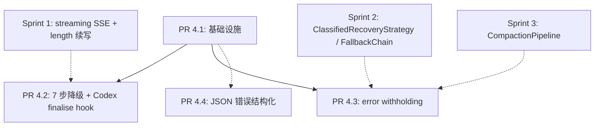

# Sprint 4 总览 — 空响应 7 步降级 + Codex finalise hook + Tool 容错完善

> **版本说明（含 Codex 反馈采纳）**：原计划是"9 步降级"。审稿后采纳 Codex 反馈 #3 / #4，
> 现调整为：
> - **7 步空响应降级**（pipeline 内）：truncated_prefix → partial_stream → housekeeping →
>   post_tool_nudge → thinking_prefill → retry/fallback → terminal。
> - **1 个 finalise pre-hook**（pipeline 外）：Codex intermediate ack。它操作非空 content，
>   不属于"空响应"语义，单独挂在 finalise 入口。
>
> 详细修订点和理由见各 PR 文档开头的"与原计划的关键差异"小节。

## 一、为什么要重新设计 Sprint 4

### 1.1 原计划的局限

[`07_sprint_execution_plan.md`](../run-loop-roadmap/07_sprint_execution_plan.md)
原计划只列了一个粗粒度的目标：

> 让 reasoning 模型（GLM-5/QwQ/DeepSeek-R1）能稳定跑完一轮；让 JSON 错误能被模型自纠。

并把所有改动合并到一个"PR Sprint 4"里。这个方案的工程问题：

1. **范围过宽**：[`02_p0_critical_gaps.md` § P0-8](../run-loop-roadmap/02_p0_critical_gaps.md)
   定义了 9 步降级，加上 P0-4 收尾、P1-8 Codex 续写、结构问题 2 收尾，
   一个 PR 容易膨胀到数十个测试用例。
2. **风险叠加**：把"流式 partial 累计"、"thinking prefill"、"fallback provider 切换"、
   "Codex ack"放在同一 PR，任何一个出问题都会回滚所有改动。
3. **缺少基础设施层**：现有 `_empty_response_retries` 只累加不消费，
   `EMPTY_RESPONSE` 在 `agent.py:311` 被预设为默认 exit_reason；这两个语义在 Sprint 4
   会被反复读写，必须先在一个 PR 里把判定 / 计数 / surface 路径理清。
4. **JSON 容错收尾被埋没**：PR 1.3 已经做了"silent retry → inject role=tool error"两段路径，
   但错误消息是裸 `JSONDecodeError.message`，模型自纠成功率不高；这块独立成小 PR 容易做。

### 1.2 claude-code 的工程哲学

[`open-claude-code/src/utils/queryHelpers.ts:56-94`](../../tmp/claude-code-references)
和 [`open-claude-code/src/query.ts:1062-1357`](../../tmp/claude-code-references)
对"empty response"和"JSON 错误"的处理可以总结为**三句话**：

> 1. **信任模型**：assistant 返回空 + `stop_reason="end_turn"` 是合法的"我没什么要说的"信号，**不要 retry**。
> 2. **集中处理 API 级错误**：只对 `prompt_too_long` / `max_output_tokens` / `media_size` /
>    `stream_stall` 这 4 类有明确语义的错误做 withholding + recovery，其它一律 surface。
> 3. **JSON 错误 = 工具失败**：用 Zod `safeParse` → 失败构造 `tool_result is_error=True` →
>    模型下一轮看见错误自纠。**不在引擎层 retry**，错误消息要**结构化**（缺参 / 多参 / 类型错）。

### 1.3 Aether 的差异化选择

我们的目标比 claude-code 大：**多 provider（OpenAI / Anthropic / Codex / Kimi / DeepSeek-R1）+
多模型（thinking / non-thinking / reasoning-only）**。所以不能简单照搬"信任模型"的简化哲学。
但 claude-code 的**结构化错误格式 + withholding 模式 + 严格的 stop_reason 判定**值得借鉴。

**Sprint 4 实施路线**：

- **借鉴 claude-code 的 4 个设计**：
  1. `isResultSuccessful` 风格的合法-空响应判定器
  2. `formatZodValidationError` 风格的结构化 JSON 错误
  3. API-error withholding 模式（streaming 阶段 hold 住可恢复错误，统一进 recovery）
  4. `(no content)` 占位仅用于显示层，不污染 final_response
- **保留并落地空响应降级**：但**重新排序**（truncated_prefix 提到首位，partial stream 第二，
  housekeeping fallback 第三——见设计 C）、**合并退化项**（同 provider retry 与 fallback 合并到 step 6）、
  **移除有害项**（terminal step 不再写 `(empty)` 占位）。
- **Codex ack 移到 finalise pre-hook**：它操作非空 content，原计划放在 empty pipeline 里
  永远跑不到（Codex 反馈 #3）；改成 finalise 阶段的独立拦截。
- **截断 prefix 拼接保持但提优先级**：原本是最末尾的第 9 步，提到第 1 步——否则
  partial_stream_recovery 会先把 streamed text 用掉，prefix 没机会拼接（Codex 反馈 #4）。

## 二、Sprint 4 的范围地图

### 2.1 涉及的缺口

| 缺口 ID | 位置 | 描述 | Sprint 4 中的角色 |
|---|---|---|---|
| **P0-8** | [`02_p0_critical_gaps.md` § P0-8](../run-loop-roadmap/02_p0_critical_gaps.md) | 空响应 / Thinking-only 降级 | **核心**（PR 4.1 + PR 4.2，落地为 7 步 pipeline） |
| **P0-4 收尾** | [`02_p0_critical_gaps.md` § P0-4](../run-loop-roadmap/02_p0_critical_gaps.md) | JSON 错误 retry + 注入 tool error 让模型自纠 | **结构化升级**（PR 4.4） |
| **P1-8** | [`03_p1_robustness_gaps.md` § P1-8](../run-loop-roadmap/03_p1_robustness_gaps.md) | Codex incomplete 续写 | **PR 4.2 finalise pre-hook**（不在 7 步 pipeline 内；Codex 反馈 #3 修订） |
| **结构问题 2 收尾** | [`07_sprint_execution_plan.md`](../run-loop-roadmap/07_sprint_execution_plan.md) Sprint 4 段 | `_empty_response_retries` 移到 metadata（已部分迁移到 `TURN_KEY_EMPTY_RESPONSE_RETRIES`） | **PR 4.1** 完成消费侧 |

### 2.2 关键差异化设计

#### **设计 A：合法-空响应判定器**（claude-code 直接借鉴）

灵感来自 [`open-claude-code/src/utils/queryHelpers.ts:isResultSuccessful`](../../tmp/claude-code-references)：

```python
def is_legitimate_empty(response, stop_reason) -> bool:
    """空响应在以下条件下是合法的：

    1. assistant 最后一块是 thinking / redacted_thinking 且 stop_reason="end_turn"
    2. assistant 完全没 content 但 stop_reason="end_turn"
    """
```

避免对 anthropic-extended-thinking 模型误判进 7 步空响应降级。

#### **设计 B：API-error withholding**（claude-code 借鉴 + 改造）

`prompt_too_long` / `max_output_tokens` / `payload_too_large` 类错误**在 streaming 阶段不立即 yield 出去**，
而是收进 `withheld_errors` 列表，等 streaming 结束后统一进 recovery。

好处：
- UI 不会闪烁"Error → Retry → OK"。
- 历史不会被半截 error 污染（避免下一轮 prompt 里出现失败标记）。
- recovery 路径可以做"先尝试 collapse / reactive compact 再 surface"的级联。

#### **设计 C：7 步空响应降级 + 1 个 finalise pre-hook（重排后的最终版）**

[`02_p0_critical_gaps.md`](../run-loop-roadmap/02_p0_critical_gaps.md) 给出了原 9 步顺序；
经 Codex 反馈 #3 / #4 修订后，我们在 PR 4.2 中按以下细节实施：

**七步空响应 pipeline**（全部在 `_finalize_empty_response` 的 BUG_EMPTY 分支）：

| 序号 | 名称 | claude-code 对应 | Aether 实施位置 | 触发条件 |
|---|---|---|---|---|
| **1** | **truncated prefix concat**（**原 step 9，新提到首位**）| 否（独有；PR 1.2 length 续写产物）| `agent.py::_handle_empty_response` 第 1 段 | `TURN_KEY_TRUNCATED_RESPONSE_PREFIX` 非空 |
| 2 | partial stream recovery（原 step 1）| 否（claude-code 不复用半截）；其改用非流式重试 | 第 2 段 | `streamed_assistant_text` 非空（且 step 1 没接管）|
| 3 | 上轮 housekeeping fallback（原 step 2）| 否（独有） | 第 3 段 | `SessionRuntimeState.last_assistant_tools_all_housekeeping=True` |
| 4 | post-tool empty nudge（原 step 3）| 间接（per-tool result text，e.g. TodoWriteTool） | 第 4 段 | 上 5 条有 `role=tool` |
| 5 | thinking prefill（原 step 4）| 否（claude-code 接受 thinking-only） | 第 5 段 | `metadata["reasoning_content"] / ["reasoning_details"] / <think>` 任一存在 |
| 6 | 空响应 retry / fallback provider（原 step 5+6 合并）| 部分（`FallbackTriggeredError`） | 第 6 段 | retry budget 未耗尽 |
| 7 | 终态 `EMPTY_RESPONSE` | 同（`isResultSuccessful` 返回 false 的情况） | 第 7 段 | 前 6 步全失败 |

**Pipeline 外的 finalise pre-hook**（在 `_finalize_empty_response` 的 `final_response != ""` 分支头部）：

| 名称 | claude-code 对应 | Aether 实施位置 | 触发条件 |
|---|---|---|---|
| **Codex intermediate ack**（**原 step 8，移出 pipeline**）| 否（claude-code 仅 anthropic） | `agent.py::_maybe_continue_codex_intermediate_ack` | provider 是 codex+responses；非空 content；tool_calls=[]；内容像 ack |

**关键工程纪律**：
- 步骤 1-3 是"零额外 LLM、纯本地数据"路径——优先用上一轮残留信息抢救本轮。
- 步骤 4-5 是"一次额外 LLM round 试一下"——nudge / prefill 走主 provider 再来一次。
- 步骤 6 是"换 provider"——同 provider 重试用尽时切 fallback。
- 步骤 7 是"宣布失败，但不污染 final_response"——展示层渲染 `(no content)`，引擎只 surface ExitReason。
- finalise pre-hook 是"provider 特定收尾"，gated by `_is_codex_responses_provider(provider)`。

#### **设计 D：JSON 错误结构化**

灵感来自 [`open-claude-code/src/utils/toolErrors.ts:formatZodValidationError`](../../tmp/claude-code-references)。
现状（PR 1.3）：注入的 tool error content 是 `f"Error: Invalid JSON arguments. {err_msg}"`，
其中 `err_msg = str(JSONDecodeError)`，例如 `"Expecting ',' delimiter: line 1 column 23 (char 22)"`。

**升级目标**：把错误分类成 3 类（缺参 / 多参 / 类型错），生成模型友好的可读文本。
对 JSON 错误（不是 schema 错误）也要给出"提示位置 + 上下文"。

## 三、与既有 Sprint 的接合

### 3.1 Sprint 0/1/2 已经做了什么（对 Sprint 4 的支撑）

| 来源 | 名称 | Sprint 4 如何复用 |
|---|---|---|
| Sprint 0 | `TurnContext.metadata` + `SessionRuntimeState` | 7 步的所有计数器 / 状态都放在 `context.metadata`，零 `self.` 实例属性；housekeeping 跨 turn 状态例外，落到 `SessionRuntimeState` 字段（见 PR 4.1 § 3.4b）|
| Sprint 0 | `RecoveryStrategy` Protocol | PR 4.3 的 withholding 路径直接复用 `ClassifiedRecoveryStrategy` |
| Sprint 1 / PR 1.1 | `validate_response` + 流式 SSE + stale-stream | PR 4.3 在 streaming 阶段做 withhold 时复用 stale-stream 检测 |
| Sprint 1 / PR 1.2 | `_handle_length_finish_reason` + thinking-budget friendly exit | 7 步 step 1（重排后的首位）"截断 prefix 拼接"复用 length 续写的 prefix 缓存 |
| Sprint 1 / PR 1.3 | `_validate_tool_call_arguments` + 截断 tool_call 检测 | PR 4.4 升级**已有**的 invalid-JSON inject 路径，不重做 |
| Sprint 2 / PR 2.2 | `ClassifiedRecoveryStrategy` + `FallbackChain` | 7 步 step 6"切 fallback"直接调 `chain.activate_next()` |
| Sprint 1.5 | `phantom_tool` 合成 | PR 4.2 第 4 步"thinking prefill"判定与 phantom tool 互斥（避免双重恢复） |
| Sprint 3 | `compression_enabled` + 五级流水线 | PR 4.3 withholding 中的 `prompt_too_long` recovery 直接调 `CompactionPipeline` |

### 3.2 Sprint 5 会接续做什么

Sprint 5（[`07_sprint_execution_plan.md`](../run-loop-roadmap/07_sprint_execution_plan.md) 第 323-367 行）
聚焦 prompt cache + reasoning 续传 + 增量持久化。Sprint 4 的"thinking prefill"产物会被
Sprint 5 的 `MessageBuilder.pop_thinking_prefill_messages()` 清理，**两者必须约定相同的标记字段**：

```python
# Sprint 4 标记
{"role": "assistant", "content": [...], "_thinking_prefill": True}

# Sprint 5 清理逻辑
def pop_thinking_prefill_messages(messages):
    return [m for m in messages if not m.get("_thinking_prefill")]
```

## 四、PR 拆分总览

| PR | 主题 | 依赖 | 关键文件 | 工时 |
|---|---|---|---|---|
| [`PR 4.1`](./01_pr4_1_foundations.md) | 基础设施：合法-空判定 + 结构化错误工具 + 计数器消费 | 无 | `runtime/response_classification.py`（新）+ `runtime/tool_error_format.py`（新）+ `agent.py` | 1.5 天 |
| [`PR 4.2`](./02_pr4_2_empty_response_degradation.md) | 7 步空响应降级 + Codex finalise pre-hook | PR 4.1 | `agent.py::_handle_empty_response` + `_maybe_continue_codex_intermediate_ack` + `EngineConfig` 9 个字段 | 3 天 |
| [`PR 4.3`](./03_pr4_3_error_withholding.md) | streaming 阶段 withholding 模式 | PR 4.1 | `agent.py::_invoke_provider_with_recovery` + `runtime/contracts.py` | 1.5 天 |
| [`PR 4.4`](./04_pr4_4_json_tolerance_polish.md) | JSON 错误结构化升级 | 无（独立） | `runtime/tool_error_format.py`（PR 4.1 起头）+ `agent.py::_validate_tool_call_arguments` | 1 天 |

总计 7 工程日 ≈ 1.5 周。

## 五、依赖关系图



实线：硬依赖（必须前置完成）。虚线：弱依赖（建议同周完成，但不阻塞）。

## 六、配置开关全景

所有 Sprint 4 引入的 `EngineConfig` 字段：

| 字段 | PR | 默认值 | 风险 | 说明 |
|---|---|---|---|---|
| `empty_response_recovery_enabled` | 4.2 | `True` | 中 | 7 步降级总开关。关掉退回原"立即 EMPTY_RESPONSE"行为 |
| `empty_response_max_retries` | 4.2 | `3` | 低 | step 6 的同 provider 重发上限 |
| `empty_response_partial_stream_recovery_enabled` | 4.2 | `True` | 低 | step 2 开关 |
| `housekeeping_fallback_enabled` | 4.2 | `True` | 低 | step 3 开关（读 SessionRuntimeState） |
| `housekeeping_tool_names` | 4.2 | `frozenset({"memory","update_todo","skill_manage","session_search"})` | 低 | step 3 白名单 |
| `post_tool_empty_nudge_enabled` | 4.2 | `True` | 低 | step 4 开关 |
| `thinking_prefill_enabled` | 4.2 | `True` | 中 | step 5 开关（读 metadata["reasoning_content"] 等） |
| `thinking_prefill_max_retries` | 4.2 | `2` | 低 | step 5 上限 |
| `codex_intermediate_ack_enabled` | 4.2 | `True` | 中 | finalise pre-hook 开关，仅 `provider_name=="codex" and api_mode=="responses"` 生效 |
| `codex_intermediate_ack_max_retries` | 4.2 | `2` | 低 | finalise pre-hook 上限 |
| `legitimate_empty_passthrough_enabled` | 4.1 | `True` | 中 | 把 `content="" + finish_reason="stop"` 视为 TEXT_RESPONSE（默认开；关掉退回旧"必降级"行为） |
| `error_withholding_enabled` | 4.3 | `True` | 中 | streaming 阶段是否 hold 住 prompt-too-long / payload-too-large / max-output-tokens 错误；包含 Codex 反馈 #6 的"已 compress 仍 withholdable → 强制升级 fallback"语义 |
| `max_provider_recovery_attempts` | 4.3 | `8` | 低 | cascade 上限，包含 forced upgrade 在内的所有 attempt 数 |
| `tool_error_structured_format_enabled` | 4.4 | `True` | 低 | 错误信息是否走结构化分类（缺参 / 多参 / 类型错） |
| `tool_schema_precheck_enabled` | 4.4 | `True` | 低 | 在 dispatch 之前预校验 tool args，命中 schema 错误时 inject 而不真正 dispatch |

**默认开 vs 默认关的判断标准**：
- 默认开：纯本地、不影响 LLM 调用次数、可单元测试到位的（PR 4.1 全部、PR 4.4）。
- 默认开但带每步可独立关：7 步空响应降级 + Codex finalise hook（PR 4.2）每项独立可关，便于部分上线。
- 默认开但语义可观测：withholding（PR 4.3），关掉退回 Sprint 2 的"立即 surface"行为。

## 七、Sprint 4 完成的验收信号

完成时必须能复现以下场景，且全部通过：

1. **reasoning 模型完整跑完一轮**：DeepSeek-R1 在一轮中连续 3 次返回 thinking-only + 空 content，
   第 4 次拿到非空内容后整轮成功结束（exit_reason=TEXT_RESPONSE），不会过早 EMPTY_RESPONSE。
2. **流式断流后 partial 内容能被救活**：mock 流式回调累计 100 字符后断流（throw 模拟），
   `_handle_empty_response` step 2（partial_stream_recovery）从 `streamed_assistant_text` 取出累计内容，
   `result.final_response` 是这 100 字符（去掉 `<think>` 标签后），不是空。
3. **JSON 错误触发结构化提示**：模型 emit `tool_calls=[{"name":"read_file","arguments":'{"pth":"a"}'}]`
   （typo + 缺 `path`），3 次 silent retry 后注入的 tool error 含
   `"The required parameter \`path\` is missing"` 而不是 `"Expecting ',' delimiter"`。
   （Codex 反馈 #7：read_file 真实参数是 `path` 不是 `file_path`）
4. **prompt_too_long 错误不污染 UI**：mock provider 流式中途 yield `prompt_too_long` 错误，
   UI 看不到错误闪烁，`recovery_strategy` 直接进 collapse + reactive compact；
   即使两次都不够，引擎会**强制升级 fallback**（Codex 反馈 #6）；恢复后整轮正常完成。
5. **Codex "好的我马上去做" 能被 finalise hook 推进**：mock codex provider
   （`provider_name="codex" + api_mode="responses"`）返回
   content=`"好的，我马上去做读文件的操作"`、tool_calls=[]，
   finalise pre-hook（`_maybe_continue_codex_intermediate_ack`）注入续写 system 消息，
   下一轮 codex 真的 emit tool_calls。注：这条不在 7 步 pipeline 内（Codex 反馈 #3）。
6. **housekeeping fallback 命中**：上一轮
   `SessionRuntimeState.last_assistant_text_with_tools="OK"` 且
   `last_assistant_tools_all_housekeeping=True`（Codex 反馈 #5：跨 turn 状态放
   SessionRuntimeState 不放 metadata）；本轮空响应 → final_response="OK"，
   `metadata["empty_recovery"]["last_step"] == "housekeeping_fallback"`。
7. **truncated prefix 优先于 partial stream**：当存在 prefix 且本轮有 streamed text 时，
   step 1 truncated_prefix_concat 命中拼接 prefix+streamed，step 2 partial_stream 不再 fire
   （Codex 反馈 #4 排序）。
8. **thinking prefill 数据来源**：响应 `metadata["reasoning_content"]="..."` 时
   `classification.has_thinking=True` 触发 step 5；不再依赖不存在的
   `response.reasoning` 字段（Codex 反馈 #1）。

详细测试矩阵见 [`99_acceptance_matrix.md`](./99_acceptance_matrix.md)。

## 八、风险与缓解

| 风险 | 缓解 |
|---|---|
| 7 步降级误触把"模型故意 stop_reason=end_turn"当成 bug 反复 retry | PR 4.1 的 `is_legitimate_empty` 判定器**先于**所有 7 步执行；only proceed 进降级如果 `is_legitimate_empty == False` |
| Sprint 1 已有的 phantom-tool / length 续写 / invalid-JSON 路径与 7 步打架 | 7 步**只在所有其它 recovery 都没命中**时才进入；agent.py 的状态机分支顺序为：phantom-tool → length-finish → invalid-JSON → empty-response（最后） |
| thinking prefill 把已经在 Sprint 5 才能正确处理的 reasoning content 永久写入历史 | thinking prefill 注入的消息打 `"_thinking_prefill": True` 标记；Sprint 5 的 `MessageBuilder.pop_thinking_prefill_messages` 会清理；同 turn 内成功响应后立即 `_pop_thinking_prefill_messages(messages)` |
| Codex ack 规则被普通对话模式误触发（"好的我看一下"） | 仅在 `_is_codex_responses_provider(provider)`（即 `provider_name=="codex" and api_mode=="responses"`）启用；其它 provider 即便 content 含相似措辞也不触发；`tool_calls=[]` 二级 gate；`max_retries=2` 限制蔓延 |
| withholding 让 stream callback 的"行内 token 计数"错乱 | withholding 只 hold **错误**消息，不影响 `stream_callback` 的 delta 流；count-only callback 一直触发 |
| 7 步降级状态字段太多导致 metadata 杂乱 | 集中放在 `metadata["empty_recovery"]`（嵌套字典），外层只读 `compaction` / `iteration_budget` 那种风格 |
| 与 Sprint 3 的 `EMPTY_RESPONSE` 上下文阻塞冲突（agent.py:2842 的 stuck_after_tool 启发式） | PR 4.1 在改 EMPTY_RESPONSE surface 路径时同步检查该启发式仍可工作；新增 `metadata["empty_recovery"]["last_step"]` 让 stuck_after_tool 可以读出 |
| housekeeping 跨 turn 状态丢失（Codex 反馈 #5）| 状态放 SessionRuntimeState（与 `memory_nudge_counter` 同级），不依赖 `request.metadata` 回灌；session 销毁时随 SessionRuntimeRegistry.discard 自动清理 |
| Codex ack 改成 finalise hook 后忘记接合点导致永远跑不到（Codex 反馈 #3）| `_finalize_empty_response` 的 `final_response != ""` 分支头部强制调用；T-H1 / T-I6 双重验证 |
| Cascade 在 strategy 一直只给 compress_context 时永远拿不到 fallback（Codex 反馈 #6）| 引擎层在 `_maybe_upgrade_decision_for_repeat_withholding` 强制升级；T-B5/B6/B7/B8 覆盖 |

## 九、下一步

按 PR 编号依次实施：

1. 先读 [`01_pr4_1_foundations.md`](./01_pr4_1_foundations.md) 落地 PR 4.1。
2. 跑完该 PR 的"验收门"小节后再进入下一个 PR。
3. 中途任何设计偏差都先回到本目录追加文档说明。
4. PR 4.4 可与 PR 4.2 并行（无硬依赖）。

## 十、与 claude-code 的对照表（一图速查）

| Aether 7 步 + finalise hook | claude-code 实际行为 | 差异理由 |
|---|---|---|
| **step 1. truncated prefix concat**（提到首位）| ❌ 无对应 | Aether 独有（PR 1.2 length 续写产物）；Codex 反馈 #4 修订：必须先于 partial_stream，否则 streamed 被吃掉 prefix 没机会拼接 |
| step 2. partial stream recovery | 抛错 → 切非流式重试整轮 | Aether 多 provider，非流式 fallback 不一定可用 |
| step 3. 上轮 housekeeping fallback（SessionRuntimeState 路径）| ❌ 无对应 | Aether 独有（处理 memory/todo 工具串后空响应）；Codex 反馈 #5 修订：放 SessionRuntimeState 不放 metadata |
| step 4. post-tool empty nudge | TodoWriteTool 内置 "Please proceed"；通用版无 | Aether 在引擎层做更通用的覆盖 |
| step 5. thinking prefill（读 metadata["reasoning_content"]）| 接受 thinking-only 为 success（`isResultSuccessful` 返回 true） | Aether 的 reasoning 模型行为各异，需要 prefill；Codex 反馈 #1 修订：不读不存在的 `response.reasoning` |
| step 6. retry + fallback（合并）| 仅在 `FallbackTriggeredError`（5xx/overload）触发 fallback | Aether 把 empty 也算"潜在可恢复" |
| step 7. 终态 EMPTY_RESPONSE | `error_during_execution`（非 success） + `NO_CONTENT_MESSAGE` 仅显示层 | **借鉴**：不写占位进 final_response |
| **finalise hook**. Codex intermediate ack | ❌ 无（claude-code 仅 anthropic） | Aether 必需；Codex 反馈 #3 修订：操作非空 content，不属于 empty pipeline |
| —— | API-error withholding（含 Codex 反馈 #6 的 forced upgrade）| **借鉴**进 PR 4.3 |
| —— | `formatZodValidationError` 结构化错误 | **借鉴**进 PR 4.4 |
| —— | stop hooks 用户扩展点 | 暂不引入（Sprint 6 P2-1 hook 升级一并做） |
