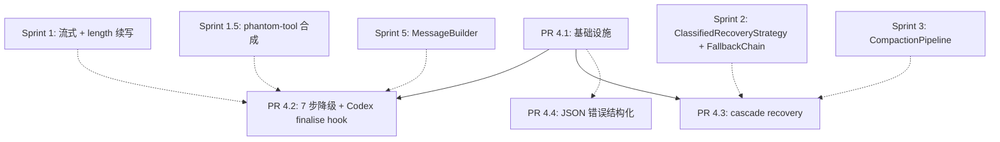

# Sprint 4 — 空响应 7 步降级 + Codex finalise hook + Tool 容错完善（详细设计文档）

> 设计版本：v1.1（含 Codex 反馈 #1 / #2 / #3 / #4 / #5 / #6 / #7 / #8 的 8 项采纳修订）。
> 各 PR 文档开头都有"与原计划的关键差异"小节列具体改动点。

> 这是 Sprint 4 的工程详细设计目录。Sprint 级别的总规划见
> [`docs/run-loop-roadmap/07_sprint_execution_plan.md`](../run-loop-roadmap/07_sprint_execution_plan.md)。
> 这里把 Sprint 4 的 4 个 PR 一一拆开，每个 PR 一份独立详细方案，
> 含数据结构、文件改动清单、测试用例、验收门、回滚开关、风险与缓解。

---

## 一、本目录的作用

- **单一事实来源**：实施期间所有疑问都在这里查；与代码同步演进。
- **PR 边界**：4 个 PR 各自独立可合入主分支，不引入未来 PR 才能修复的回归。
- **可追溯**：每条改动都对应一条文档原句，方便 review 和回滚定位。
- **claude-code 对照**：每个设计点都标注是 **借鉴 claude-code** 还是 **Aether 独有**。

## 二、文件导航

| 文档 | 内容 | 角色 |
|---|---|---|
| [`00_overview.md`](./00_overview.md) | Sprint 4 整体设计、与 claude-code 的对照表、PR 拆分依据、配置开关全景 | 入口 |
| [`01_pr4_1_foundations.md`](./01_pr4_1_foundations.md) | PR 4.1 — 基础设施：合法-空判定 + 结构化错误工具（雏形）+ EMPTY_RESPONSE surface 路径整理 | 地基 |
| [`02_pr4_2_empty_response_degradation.md`](./02_pr4_2_empty_response_degradation.md) | PR 4.2 — 7 步空响应降级 + Codex finalise pre-hook | 主体 |
| [`03_pr4_3_error_withholding.md`](./03_pr4_3_error_withholding.md) | PR 4.3 — Streaming 阶段 API 错误 cascade recovery（withholding 模式） | 主体 |
| [`04_pr4_4_json_tolerance_polish.md`](./04_pr4_4_json_tolerance_polish.md) | PR 4.4 — JSON / schema 错误结构化升级 | 收尾 |
| [`99_acceptance_matrix.md`](./99_acceptance_matrix.md) | 端到端验收场景（11 个）、单测覆盖矩阵、性能基准、监控指标 | 验收 |

## 三、阅读顺序

1. **先读 [`00_overview.md`](./00_overview.md)** 拿到整体心智模型（含与 claude-code 的差异对比）。
2. 实施时按 **PR 编号顺序**读对应 PR 文档（PR 4.1 → 4.2 / 4.3 / 4.4）。
3. PR 4.2 与 PR 4.3 互不阻塞、可并行；PR 4.4 与 PR 4.2 也可并行（无硬依赖）。
4. 每个 PR 完成时回读对应 PR 文档的"验收门"小节确认通过。
5. Sprint 收尾时跑 [`99_acceptance_matrix.md`](./99_acceptance_matrix.md) 的 11 个端到端场景。

## 四、PR 速览

| PR | 主题 | 工时 | 默认开关 | 风险 |
|---|---|---|---|---|
| **4.1** | 基础设施（含 SessionRuntimeState 加 housekeeping 字段）| 1.5 天 | `legitimate_empty_passthrough_enabled=True`（仅 PR 4.1 的小行为变化）| 低 |
| **4.2** | 7 步空响应降级 + Codex finalise pre-hook | 3 天 | `empty_response_recovery_enabled=True` + 5 个子开关 + `codex_intermediate_ack_enabled` | 中 |
| **4.3** | Cascade recovery（含 forced fallback upgrade）| 1.5 天 | `error_withholding_enabled=True` | 中 |
| **4.4** | JSON 错误结构化 + ToolRegistry 公共 API | 1 天 | `tool_error_structured_format_enabled=True` + `tool_schema_precheck_enabled=True` | 低 |

总计 7 工程日 ≈ 1.5 周。

## 五、依赖关系图（速看）

实线：硬依赖。虚线：弱依赖（既有设施被复用 / 后续 Sprint 接力）。

## 六、改动约定

- 文档落地后不再做大幅结构调整，只在 PR 实施完成后追加"实施记录"段（含实际偏差、追加的测试、踩坑记录）。
- 任何超出本目录设计的工程决策（例如换 provider 抽象、引入新中间件类型）必须先在本目录追加 ADR-style 子文档，再回到对应 PR 文档更新。
- 文档与代码的对应关系：每个 PR 文档的"文件改动清单"是该 PR commit 的代码 review checklist。
- 引用 claude-code 源码统一用 `open-claude-code/src/...` 路径前缀，方便回查。

## 七、与其他文档的关系

- **总规划** [`docs/run-loop-roadmap/07_sprint_execution_plan.md`](../run-loop-roadmap/07_sprint_execution_plan.md)：
  Sprint 4 实施前同步把 "## Sprint 4" 小节内容指向本目录的 README。
- **缺口跟踪**：
  - [`docs/run-loop-roadmap/02_p0_critical_gaps.md` § P0-8](../run-loop-roadmap/02_p0_critical_gaps.md)
    Sprint 4 完成后从 ❌ 改 ✅
  - [`docs/run-loop-roadmap/02_p0_critical_gaps.md` § P0-4](../run-loop-roadmap/02_p0_critical_gaps.md)
    Sprint 4 完成后从 ⚠️ 改 ✅
  - [`docs/run-loop-roadmap/03_p1_robustness_gaps.md` § P1-8](../run-loop-roadmap/03_p1_robustness_gaps.md)
    Sprint 4 完成后从 ❌ 改 ✅
- **引擎结构** [`docs/agent-engine/`](../agent-engine/)：Sprint 4 完成后追加 `09_empty_response_pipeline.md`
  描述 7 步状态机 + Codex finalise pre-hook + cascade recovery 的实际拓扑。
- **claude-code 参考**：本目录所有 `open-claude-code/src/...` 路径都指向
  [`/workspace/open-claude-code/src/...`](../../tmp/claude-code-references)。

---

下一步：阅读 [`00_overview.md`](./00_overview.md) 了解整体设计。
