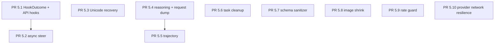

# Sprint 5 P2 UX / Observability — Overview

## 背景

现有 P2 roadmap 覆盖 12 个能力点，但原文档仍是缺口级别，不够适合作为 PR review checklist。本目录把它拆成 10 个实现 PR，按依赖顺序串起来，并把 Hermes / open-claude-code 的可借鉴点落到 Aether 当前架构上。

Aether 当前状态：

- `EngineHooks` 仍是通知型，hook 返回值会被 `_safe_call_hook` 丢弃。
- `EngineResult.metadata["reasoning"]["last_reasoning"]` 只有保留字段，没有从当前 turn 消息中抽取。
- `ErrorClassifier` 注释中保留了 `image_too_large`、`llama_cpp_grammar_pattern`、`oauth_long_context_beta_forbidden` 等未来 reason，但没有策略实现。
- Claude provider 已有 OAuth beta header 逻辑，但没有 1M context beta 拒绝后的内存级 disable/retry。
- 没有 `SteerInbox`、trajectory、rate guard、request dump、task cleanup、image shrink、schema sanitizer。

## 参考实现索引

Hermes 参考点：

- `/workspace/hermes-agent/run_agent.py`：`/steer` pending queue、pre/post API hooks、Unicode recovery、image shrink retry、rate guard、trajectory、request dump、task cleanup、last reasoning。
- `/workspace/hermes-agent/tools/schema_sanitizer.py`：递归 schema sanitizer，可作为 Aether P2-6 的上限参考。
- `/workspace/hermes-agent/tools/vision_tools.py`：图像 resize helper。
- `/workspace/hermes-agent/hermes_cli/models.py`：Anthropic OAuth long-context beta retry。
- `/workspace/hermes-agent/hermes_cli/plugins.py` 与 `hooks.py`：hook name 和 payload 样例。

open-claude-code 参考点：

- `/workspace/open-claude-code/src/types/hooks.ts`：hook response schema，说明 hook 可以是结构化控制面，而不只是通知。
- `/workspace/open-claude-code/src/utils/imageResizer.ts` 与 `src/constants/apiLimits.ts`：5MB base64 image limit、raw size target、progressive resize/downsample。
- `/workspace/open-claude-code/src/services/api/withRetry.ts`：rate limit retry-after、cooldown、fallback 思路。
- `/workspace/open-claude-code/src/utils/sessionStorage.ts`：session/trajectory 类持久化参考。
- `/workspace/open-claude-code/src/constants/oauth.ts` 与 `src/utils/http.ts`：OAuth beta header 参考。

## PR 拆分与依赖

硬依赖只有两条：

- PR 5.2 依赖 PR 5.1，因为 `/steer` 最终也需要稳定的 run-loop 注入点和 metadata 规范。
- PR 5.5 依赖 PR 5.4，因为 trajectory 要保存 reasoning 时必须先有可信的 current-turn extraction。

其他 PR 可以并行，但建议按 README 顺序实施，降低 review 复杂度。

## 公共接口变更总览

- 新增 `HookOutcome`，让 `EngineHooks.pre_llm_call(...) -> HookOutcome | None`。
- 新增 `EngineHooks.pre_api_request(...)`、`post_api_request(...)`、`on_task_cleanup(...)`。
- 新增 `AgentEngine.send_steer(session_id: str, text: str) -> bool`。
- 新增 `SteerInbox`，与 `InterruptController` 同级按 session 分槽。
- 扩展 `EngineConfig`：`rate_guard_dir`、`save_trajectories`、`trajectory_dir`、`dump_failed_requests`、`request_dump_dir`。
- 扩展 `EngineResult.metadata`：`pending_steer`、`request_dump`、`trajectory`、`resource_cleanup`；`reasoning.last_reasoning` 从占位变为真实字段。

## 非目标

- 不引入新的 provider 抽象大改。
- 不把所有 recovery 逻辑塞进 `AgentEngine.run_loop`，应优先放到 runtime helper 或 provider 层。
- 不做持久化配置 UI；本 sprint 只补 engine/runtime 能力。
- 不把 trajectory 默认开启，避免隐私和磁盘写入 surprise。

## Review 原则

- 每个 PR 必须有专项测试，不接受“后续补测”。
- 每个 retry 类能力必须有 retry 上限和 metadata 标记。
- 每个落盘类能力必须有路径可配置、默认关闭、敏感字段脱敏。
- 每个 hook 类能力必须隔离 hook 异常。
