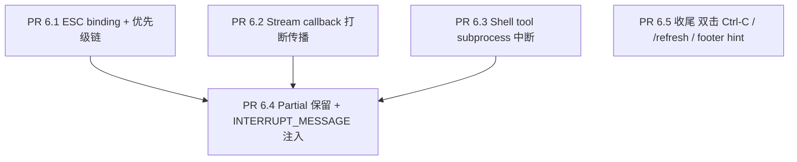

# Sprint 6 Interrupt Overhaul — Overview

## 背景

Aether 当前的"打断"功能（Ctrl-C → engine.interrupt → InterruptController flag）在以下场景**形同虚设**：

1. **模型流式输出中** —— `_build_stream_callback._wrapped` 不检查中断标志，必须等流自然结束才会到下一个 iteration boundary 检查。长回复要等 30s+。
2. **shell tool 跑长命令时** —— `subprocess.run(timeout=...)` 阻塞调用，按 Ctrl-C 也得等到子进程自然退出或超时。
3. **缺少 ESC 单按打断** —— 用户的肌肉记忆来自 claude-code/codex（ESC 是首选打断键），我们只 bind 了 Ctrl-C。
4. **打断之后模型不知情** —— 我们只设了 flag、清了 steer，但下一轮 LLM 看到的对话历史里没有 `[Request interrupted by user]` marker，模型可能直接续上一轮失败的工具尝试。
5. **打断时 partial 输出被丢弃** —— `ui._stream` 在 end_turn 里被 reset，半成品文字不进 `state.messages`，下次模型要重写一遍。

参考 `/workspace/open-claude-code` 的实现：

- `src/utils/messages.ts` 行 207-209：`INTERRUPT_MESSAGE` / `INTERRUPT_MESSAGE_FOR_TOOL_USE` 两个区分性的 marker。
- `src/screens/REPL.tsx` 的 `onCancel()`：取消时 `setMessages(prev => [...prev, createAssistantMessage({ content: streamingText })])` 先保存半成品，再 `abortController?.abort('user-cancel')`。
- `src/hooks/useCancelRequest.ts`：ESC + Ctrl-C 双绑 `chat:cancel` action，按优先级链派发（active task → queue pop → fallback）。
- `src/keybindings/defaultBindings.ts` 行 66：`escape: 'chat:cancel'` 默认绑定。
- `src/components/PromptInput/PromptInput.tsx` 行 1922-1957：ESC 上下文分发（speculation / sideQ / help / footer / queue / messages 各自的优先级）。

## 设计原则

- **响应式打断（reactive interrupt）**：按下打断键的瞬间，所有阻塞操作（HTTP stream、subprocess、long-running tool）必须在 < 200ms 内得到通知。
- **用最小侵入达成目标**：不引入 `AbortController` 风格的全链路 signal 抽象（那需要 provider 接口大改），而是复用现有 `InterruptController` + 在关键点加 polling/checkpoint。
- **保留用户能看到的内容**：partial 流文本必须进 messages 历史，让模型重试时有上下文。
- **打断要让模型知道**：注入 `[Request interrupted by user]` 系统消息，区分"思考中"和"工具执行中"。
- **每个 PR 独立可上线**：不要一次大改全部，避免回归。

## PR 拆分与依赖

依赖说明：

- **PR 6.4 依赖 6.1、6.2、6.3**：因为 partial 保留只有在打断真的能立刻触发的前提下才有意义；如果 stream 还在跑，根本没机会"保留半成品"。
- **6.1 / 6.2 / 6.3 互相独立**，可以并行 review，按理论上谁先谁后都不影响别的。建议按 6.1 → 6.2 → 6.3 顺序，因为 6.1 改动最小、最容易看效果（按 ESC 立刻有反应），后两个更涉及 engine/tool 内部。
- **PR 6.5** 是收尾 polish，可以和 6.4 同步进行或之后再做。

## 公共接口变更总览

- **新增** `runtime/contracts.py` 中 `EngineRequest.interrupt_check: Callable[[], bool] | None` —— 可选回调，让 provider/tool 在长操作中 poll 是否被中断。
- **新增** `runtime/exceptions.py` 中 `EngineInterrupted(RuntimeError)` —— stream callback / tool 在检测到 interrupt 时抛出，上层捕获后走 INTERRUPTED 退出路径，保留 partial 状态。
- **新增** `agents/core/agent.py` 上 `_inject_interrupt_message(messages, in_tool_call: bool)` helper，把 marker 写入 messages 数组（不进入 SessionStore，由 repl 层接管）。
- **扩展** `EngineResult.metadata`：`interrupt`（{`triggered_at`, `was_in_tool_call`, `partial_assistant_chars`}），便于事后分析。
- **扩展** `cli/app.py`：新增 ESC 单按 binding；Ctrl-C 改为双击退出（idle 时）。
- **新增** `cli/commands.py`：`/refresh` slash 命令做手动屏幕清理。

## 非目标

- **不引入 `AbortController`-style 全链路 signal**：现有 `InterruptController` 足够，加 polling 检查点更符合 Python 习惯。
- **不改 provider 接口**：provider 不需要新增 cancel 参数；改用 `interrupt_check` callback + 抛 `EngineInterrupted` 由 wrapper 处理。
- **不实现"发送打断消息"的 IPC**（claude-code 远程模式才有）：单进程 REPL 用不到。
- **不强制要求所有 tool 都支持中断**：只把最常用的 `Bash` / `Shell` 改造，其他 tool 默认在调用边界检查（同现状）。
- **不写盘任何打断 telemetry**：debug log 即可，不引入 trajectory 之类的持久化。

## 验收原则

- 每个 PR 必须有专项测试，不接受"后续补测"。
- 中断响应延迟必须 < 500ms 测得（用 `time.monotonic()` 验证）。
- 中断后必须保证 `EngineResult.status == ExitReason.INTERRUPTED` 且 `result.messages` 末尾两条是 `[partial assistant, interrupt marker]`。
- 中断后下一轮 turn 必须能正常发起（不能因为旧的 interrupt 状态卡死）。
- 任何中断路径上的 exception 都不能让 REPL 退出。

## 风险与回退

- **风险 1：抛 `EngineInterrupted` 的位置太深，被中间层捕获吞掉**。
  - 缓解：明确把 `EngineInterrupted` 列入 provider wrapper / middleware 的 "must re-raise" 白名单。
  - 回退：fallback 到 polling-only（不抛异常），打断响应时间从 < 200ms 退化到 < 1s。
- **风险 2：subprocess SIGTERM 后 hung（如 Python 进程吞 SIGTERM）**。
  - 缓解：grace period 2s 后 SIGKILL；不依赖子进程合作。
  - 回退：如果 SIGKILL 也 hung（kernel 状态），at least Aether 进程能继续，子进程变 zombie 由 OS 回收。
- **风险 3：ESC 单按 binding 跟 prompt_toolkit 默认 ESC-序列冲突**（Vim mode、Alt 键映射）。
  - 缓解：用 `eager=True` + 配合 `escape,enter` 已有 binding 的优先级；Vim mode 用户在 INSERT 模式下 ESC 应该走 mode-exit 而非中断。
  - 回退：保留 Ctrl-C 作为兜底，ESC 失效时用户仍可用。
