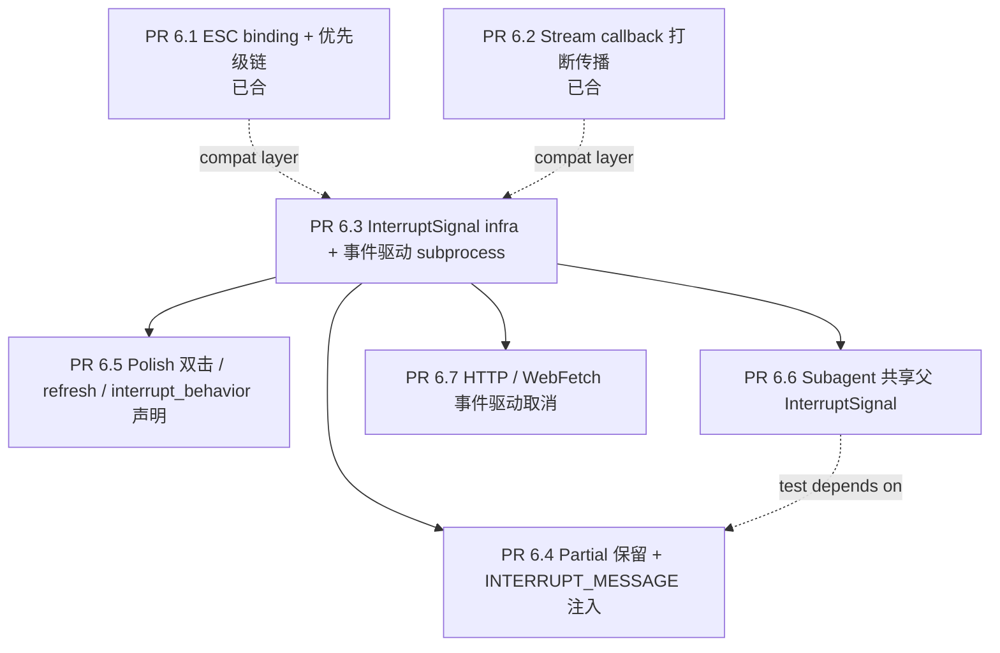

# Sprint 6 Interrupt Overhaul — Overview

> **Architecture revision (Sprint 6 mid-sprint, after PR 6.1 / 6.2)**:
> 在跑完 PR 6.1 / 6.2 之后做了一次架构 review，参考 `/workspace/open-claude-code`
> 的 `AbortController` / `AbortSignal` 设计，决定把"flag + polling"模型升级成
> **事件驱动的 `InterruptSignal` hybrid**。PR 6.3 起所有后续 PR 都在这个新基座上做；
> PR 6.1 / 6.2 已合的实现通过 wrapper 保持 API 向后兼容，不需要重新写。
> 详见后面的"架构演进"小节。

## 背景

Aether 当前的"打断"功能（Ctrl-C → engine.interrupt → InterruptController flag）在以下场景**形同虚设**：

1. **模型流式输出中** —— `_build_stream_callback._wrapped` 不检查中断标志，必须等流自然结束才会到下一个 iteration boundary 检查。长回复要等 30s+。
2. **shell tool 跑长命令时** —— `subprocess.run(timeout=...)` 阻塞调用，按 Ctrl-C 也得等到子进程自然退出或超时。
3. **缺少 ESC 单按打断** —— 用户的肌肉记忆来自 claude-code/codex（ESC 是首选打断键），我们只 bind 了 Ctrl-C。
4. **打断之后模型不知情** —— 我们只设了 flag、清了 steer，但下一轮 LLM 看到的对话历史里没有 `[Request interrupted by user]` marker，模型可能直接续上一轮失败的工具尝试。
5. **打断时 partial 输出被丢弃** —— `ui._stream` 在 end_turn 里被 reset，半成品文字不进 `state.messages`，下次模型要重写一遍。
6. **Subagent / Task tool 不传播打断** —— `_interrupt_active_children` 只在父 controller 设标志，但子 engine 持有独立的 `InterruptController`，flag 设了等于没设。
7. **HTTP / WebFetch tool 阻塞** —— `httpx`、`requests` 调用没接 cancellation；按 ESC 之后还要等远端响应或 TCP 超时。

参考 `/workspace/open-claude-code` 的实现：

- `src/utils/abortController.ts` 行 68：`createChildAbortController(parent)` —— 用 `WeakRef` 把 child controller 挂在 parent 的 `'abort'` 事件上。父 abort 自动传给所有 child，事件驱动零延迟。
- `src/tools/AgentTool/runAgent.ts` 行 520-528：sync subagent 直接复用 `toolUseContext.abortController`；async 才新建。
- `src/utils/Shell.ts` 行 181-345：`exec(command, abortSignal, ...)` —— `spawn` 之后用 `abortSignal.addEventListener('abort', () => treeKill(pid, 'SIGKILL'))` 接事件，零 polling。
- `src/tools/WebFetchTool/utils.ts` 行 417-421：HTTP 请求把 `abortSignal` 直接传给 axios；远端没回也能立刻断开。
- `src/Tool.ts` 行 416：每个 tool 定义 `interruptBehavior?(): 'cancel' | 'block'`，引擎按 tool 自己的声明决定打断时是否 kill。
- `src/utils/messages.ts` 行 207-209：`INTERRUPT_MESSAGE` / `INTERRUPT_MESSAGE_FOR_TOOL_USE` 两个区分性 marker。
- `src/screens/REPL.tsx` 的 `onCancel()`：取消时 `setMessages(prev => [...prev, createAssistantMessage({ content: streamingText })])` 先保存半成品，再 `abortController?.abort('user-cancel')`。
- `src/hooks/useCancelRequest.ts`：ESC + Ctrl-C 双绑 `chat:cancel` action，按优先级链派发（active task → queue pop → fallback）。

## 架构演进 ：polling → event-driven hybrid

### 旧模型（PR 6.1 / 6.2 实施时采用）

```
InterruptController (dict[session_id → flag])
  └─ engine.interrupt(session_id) → flag = True
  └─ 各 checkpoint 主动 polling
       ├─ stream callback 每个 delta 入口 poll （PR 6.2 已实施）
       ├─ run_loop iteration boundary poll
       └─ tool 自己每 200ms poll（PR 6.3 原计划）
```

**优点**：实现简单，flag 是 thread-safe 的 dict + RLock。
**致命缺点**：subprocess / HTTP / subagent 等"被阻塞在外部资源里"的代码**没法 poll**，必须依赖外部资源自然超时。

### 新模型（PR 6.3 起引入）

```
InterruptSignal (per session, threading.Event + listener list + parent ref)
  ├─ abort(reason="user-interrupt") → event.set() + fire listeners
  ├─ is_aborted() → event.is_set()
  ├─ wait(timeout) → event.wait(timeout)              [给 polling 兼容]
  ├─ add_listener(cb)/remove_listener(cb)            [事件驱动]
  └─ 父子关系：child.parent.add_listener(child.abort)

session_signal: InterruptSignal           ← REPL 持有，按 ESC 时 .abort()
  ├─ stream-callback 用 is_aborted()      [chunk 间还是 polling — 不能事件 wait]
  ├─ shell tool: add_listener(SIGTERM → 2s grace → SIGKILL via os.killpg)
  ├─ webfetch tool: add_listener(httpx_client.close())
  └─ subagent task → child_signal = InterruptSignal(parent=session_signal)
       └─ subagent 内部的 stream + tool 用 child_signal（自动继承）
```

`InterruptController` 的旧 API（`request` / `is_interrupted` / `clear`）通过 wrapper 重定向到 `InterruptSignal`，PR 6.1 / 6.2 的调用点不动。

### 三个原语的职责划分

| 原语 | 适用场景 | 例子 |
|---|---|---|
| `is_aborted()` polling | 高频 ms 级 chunk 间检查 | stream callback per-delta、run_loop iteration boundary |
| `add_listener(cb)` 事件驱动 | 长阻塞 IO 持有外部句柄 | subprocess kill、httpx client close、WS socket close |
| `wait(timeout)` 中断式阻塞 | 内部 sleep / backoff，希望中断时立即返回 | recovery wait、retry backoff |

### 跟 open-claude-code 的对应

| Aether | open-claude-code | 差异 |
|---|---|---|
| `InterruptSignal` | `AbortSignal`（Web 标准） | Aether 自己包 `threading.Event`，Python 没有原生 AbortSignal |
| `InterruptSignal(parent=...)` | `createChildAbortController(parent)` | 同思想；Python 不用 `WeakRef`（用 listener 显式 removal） |
| `signal.add_listener(cb)` | `signal.addEventListener('abort', cb)` | 同 |
| `signal.abort(reason)` | `controller.abort(reason)` | 同 |
| tool 的 `interrupt_behavior` | tool 的 `interruptBehavior()` | 同思想；Python 用类属性 |
| `os.killpg` + grace SIGTERM/SIGKILL | `tree-kill` 库 | 同思想；Python 用标准库 |

## 设计原则

- **事件驱动优先，polling 次之**：能用 `add_listener` 的地方就别 polling；polling 只用在 chunk-level / iteration boundary 这种自然有"下一次回到 Python 代码"的点。
- **零延迟父子传播**：subagent / Task tool 默认共享父 `InterruptSignal`，按一次 ESC 整棵子树同时停。
- **保留用户能看到的内容**：partial 流文本必须进 messages 历史，让模型重试时有上下文。
- **打断要让模型知道**：注入 `[Request interrupted by user]` 系统消息，区分"思考中"和"工具执行中"。
- **Tool 自治声明**：每个 tool 在自己的定义里声明 `interrupt_behavior`（cancel / block），引擎按声明派发。
- **每个 PR 独立可上线**：不要一次大改全部，避免回归。

## PR 拆分与依赖



依赖说明：

- **PR 6.1 / 6.2 已合**：用旧 `InterruptController` 实现。PR 6.3 引入 `InterruptSignal` 时给 `InterruptController` 加 wrapper（旧调用点不动）。**两者不冲突，PR 6.3 不需要回改 6.1 / 6.2 的实现**。
- **PR 6.3 是后续所有 PR 的基础**：InterruptSignal 在这里建立；同时把 shell tool 改成事件驱动。
- **PR 6.4 依赖 6.3**：partial 保留 / marker 注入需要从 signal 的 listener 拿"打断时的状态"（是不是在 tool 中、partial_text 是什么）。
- **PR 6.5 polish**：双击 toast / `/refresh` / `interrupt_behavior` 声明。可以跟 6.4 并行。
- **PR 6.6 subagent**：sync subagent 复用父 signal，零代码传播。依赖 6.3 的 signal 基建。
- **PR 6.7 HTTP**：WebFetch / HTTP-based MCP / WS 用 signal listener 关 client。依赖 6.3。

合并顺序建议：**6.3 先 → 然后 6.4 / 6.5 / 6.6 / 6.7 任意并行**。

## 公共接口变更总览

### 已合（PR 6.1 / 6.2）

- **新增** `runtime/exceptions.py` 中 `EngineInterrupted(BaseException)` —— stream callback / tool 在检测到 interrupt 时抛出，上层捕获后走 INTERRUPTED 退出路径。
- **扩展** `EngineResult.metadata["interrupt"]`：`{reason, partial_text, was_in_tool_call, triggered_at}`，便于事后分析。
- **扩展** `cli/app.py`：ESC 单按 binding + Ctrl-C 双击退出（idle 时）。

### 后续 PR（6.3-6.7）

- **新增** `runtime/interrupt_signal.py` 中 `InterruptSignal` 类：`abort(reason)` / `is_aborted()` / `wait(timeout)` / `add_listener(cb)` / `remove_listener(cb)`，构造时可选 `parent` 参数自动继承。
- **改造** `runtime/interrupts.py` 中 `InterruptController`：内部把 flag dict 换成 `dict[session_id, InterruptSignal]`，旧 API（`request` / `is_interrupted` / `clear`）保留作为薄包装。
- **扩展** `EngineRequest`：`interrupt_signal: InterruptSignal | None = None` ——可由 caller 传入（subagent 用），未传则 engine 从 `services.interrupt_controller` 拿默认 session-scoped signal。
- **新增** `runtime/interrupt_messages.py`：`INTERRUPT_MESSAGE` / `INTERRUPT_MESSAGE_FOR_TOOL_USE` / `select_interrupt_marker`。
- **新增** `tools/base.py` 中 `ToolExecutor.interrupt_behavior: Literal["cancel", "block"] = "block"` 类属性。
- **新增** `cli/commands.py`：`/refresh` slash 命令做手动屏幕清理。

## 非目标

- **不强制把每个 tool 都改成事件驱动**：ms 级的 `Read` / `Edit` 保留默认 `block`；只有 long-running / external-IO tool（Bash / Shell / WebFetch / HTTP MCP）才标 `cancel` 并接 signal listener。
- **不实现"发送打断消息"的 IPC**（claude-code 远程模式才有）：单进程 REPL 用不到。
- **不写盘任何打断 telemetry**：debug log 即可，不引入 trajectory 之类的持久化。

## 验收原则

- 每个 PR 必须有专项测试，不接受"后续补测"。
- 中断响应延迟必须 < 500ms 测得（用 `time.monotonic()` 验证）。
- 中断后必须保证 `EngineResult.status == ExitReason.INTERRUPTED` 且 `result.messages` 末尾两条是 `[partial assistant, interrupt marker]`。
- 中断后下一轮 turn 必须能正常发起（不能因为旧的 interrupt 状态卡死）。
- 任何中断路径上的 exception 都不能让 REPL 退出。
- **新增**：subagent / WebFetch 中断手测必须 < 700ms 响应。

## 风险与回退

- **风险 1：`InterruptSignal` listener 累积导致内存泄漏**。
  - 缓解：listener 只在显式 `add_listener` 时注册，退出时 `remove_listener`。每个 tool / fetch 在 `try/finally` 里清。
  - 回退：用 `weakref.WeakMethod` 或一次性 listener（fire 后自动移除）。
- **风险 2：subprocess SIGTERM 后 hung（如 Python 进程吞 SIGTERM）**。
  - 缓解：grace period 2s 后 SIGKILL；不依赖子进程合作。
  - 回退：如果 SIGKILL 也 hung（kernel 状态），at least Aether 进程能继续，子进程变 zombie 由 OS 回收。
- **风险 3：listener 在 ESC 触发线程里跑（不在 worker 线程）**。
  - 这是预期行为：`abort()` 是从 main thread 调，listener 同步 fire；它们必须**只做轻量同步操作**（设标志、close socket、send signal），重活留给 worker 线程的下一次 polling 检查。
  - 缓解：listener 文档明确"non-blocking only"，违反就用 `threading.Thread` wrapper。
- **风险 4：ESC 单按 binding 跟 prompt_toolkit 默认 ESC-序列冲突**（Vim mode、Alt 键映射）。
  - 缓解：用 `eager=True` + 配合 `escape,enter` 已有 binding 的优先级；Vim mode 用户在 INSERT 模式下 ESC 应该走 mode-exit 而非中断。
  - 回退：保留 Ctrl-C 作为兜底，ESC 失效时用户仍可用。
- **风险 5：`InterruptController` 旧调用点的语义假设变化**。
  - 缓解：wrapper 保证 `request` / `is_interrupted` / `clear` 的语义跟原 dict-of-flag 完全一致；写一组对比测试 pin 住。
  - 回退：保留独立的 `InterruptController` 实现作为 fallback，feature flag 切换。
