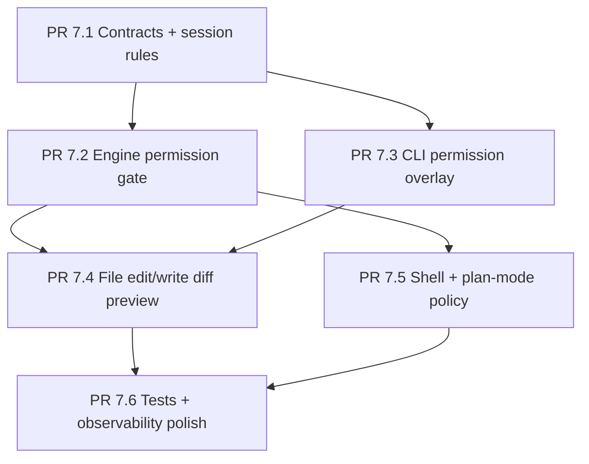

# Sprint 7 Tool Permission Confirmation - Overview

## 背景

当前问题是：模型发起 `file_edit`、`write_file`、`shell` 等工具时，用户确认不应该作为普通 assistant/tool 输出写入输出框，也不应该闪现 function call JSON。正确形态应该像 open-claude-code：工具调用进入权限队列，UI 在输入框上方的底部区域显示确认 overlay，engine 等待用户选择后再决定是否 dispatch。

Aether 当前状态：

| 模块 | 当前实现 | 缺口 |
|---|---|---|
| `backend/harness/aether/cli/approval_prompter.py` | 只服务 `exit_plan_mode` 和 `ask_user_question`，用阻塞式 prompt 或 dialog | 不是通用工具权限 gate，也不能直接嵌进长驻 `AetherApp` |
| `backend/harness/aether/runtime/contracts.py` | `EngineRequest.approval_prompter: Any` 仅转发给交互工具 | 缺少 `ToolPermissionRequest` / `ToolPermissionDecision` 契约 |
| `backend/harness/aether/agents/core/agent.py` | `before_tool` 后直接 `tool_registry.dispatch(...)` | 缺少 dispatch 前权限检查和拒绝 synthetic result |
| `backend/harness/aether/tools/registry.py` | plan mode 用 `WRITE_TOOLS_BLOCKED_IN_PLAN` 阻塞写类工具 | 阻塞逻辑和确认逻辑分散，不能表达 accept once / accept session |
| `backend/harness/aether/cli/app.py` | 长驻 prompt_toolkit layout 已有 active group、activity bar、reasoning、input、footer | 缺少 permission queue 和确认 overlay |
| `backend/harness/aether/cli/ui_middleware.py` | `before_tool()` 会先渲染工具 call header | 未批准工具会被误显示为已运行或即将运行 |
| `backend/harness/aether/tools/builtins/file_edit.py` / `write_file.py` | 执行时才读写并返回 diff/summary | 缺少执行前 preview，不能在确认 overlay 中安全展示 diff |

## open-claude-code 参考链路

open-claude-code 的关键点不是“工具自己打印确认”，而是“权限检查返回 ask 后，把一个带 callbacks 的对象塞进 REPL 队列”。

| 参考文件 | 作用 |
|---|---|
| `/workspace/open-claude-code/src/hooks/useCanUseTool.tsx` | 工具执行前统一调用 `hasPermissionsToUseTool`，结果为 `allow` 直接放行，`deny` 直接拒绝，`ask` 进入交互确认 |
| `/workspace/open-claude-code/src/hooks/toolPermission/handlers/interactiveHandler.ts` | 创建 `ToolUseConfirm`，推入 `toolUseConfirmQueue`，暴露 `onAllow`、`onReject`、`onAbort`、`recheckPermission` |
| `/workspace/open-claude-code/src/screens/REPL.tsx` | 拥有 `toolUseConfirmQueue`，从队首渲染 `PermissionRequest`，确认完成后弹出队首 |
| `/workspace/open-claude-code/src/components/permissions/PermissionRequest.tsx` | 按 tool 类型路由到不同确认组件，并绑定 interrupt/cancel |
| `/workspace/open-claude-code/src/components/permissions/FileEditPermissionRequest/FileEditPermissionRequest.tsx` | 文件编辑确认文案和 diff 组件入口，问题为是否允许对目标文件进行本次 edit |
| `/workspace/open-claude-code/src/components/permissions/FilePermissionDialog/FilePermissionDialog.tsx` | 文件权限弹窗，支持 inline diff 和 IDE diff 两种路径 |
| `/workspace/open-claude-code/src/components/permissions/FilePermissionDialog/usePermissionHandler.ts` | 将 `accept-once`、`accept-session`、`reject` 映射为 `onAllow` / `onReject` |
| `/workspace/open-claude-code/src/components/ShowInIDEPrompt.tsx` | IDE diff 打开后的确认提示，仍然由同一 permission flow resolve |

映射到 Aether 时，不需要照搬 React/Ink。Aether 已经有长驻 `prompt_toolkit.Application`，所以应该把 `ToolUseConfirmQueue` 的思想落成 `AetherApp` 内部 queue + bottom-region overlay。

## 设计原则

- 权限确认是 control plane，不是 transcript。不得通过 `console.print()`、tool result content、assistant message 或 Rich scrollback 输出确认 UI。
- engine 必须在危险工具执行前等待 decision。拒绝时工具不得执行，并返回 synthetic `ToolResult` 给模型，让模型知道用户拒绝了。
- session allow 是内存级规则，先不落盘。关闭 REPL 或换 session 后失效。
- `file_edit` / `write_file` 的 diff preview 必须在执行前构建，不能为了预览先调用 `execute()`。
- 非交互模式必须 deterministic。默认拒绝写入和 shell，除非配置显式 auto-approve。
- `CLIUIMiddleware.before_tool()` 不能在权限确认前把真实工具 call 渲染到输出框。最多更新状态栏为 awaiting approval。
- 不要在运行中的 `AetherApp` 里调用阻塞式 `prompt_toolkit.prompt()`。这会和长驻 Application 抢 terminal 控制权。

## PR 拆分与依赖

硬依赖：

| 依赖 | 原因 |
|---|---|
| PR 7.2 依赖 PR 7.1 | engine gate 需要统一的 request、decision、rule 契约 |
| PR 7.3 依赖 PR 7.1 | CLI overlay 需要实现同一个 prompter protocol |
| PR 7.4 依赖 PR 7.2 和 PR 7.3 | diff preview 既要在 gate 前构建，也要在 overlay 渲染 |
| PR 7.5 依赖 PR 7.2 | shell 和 plan-mode policy 必须走同一个 gate |

## 非目标

- 不做持久化 allowlist。`accept-session` 只在当前 session 内存生效。
- 不做完整 IDE diff 集成。第一版只做 terminal inline diff；IDE diff 可以后续单独 PR。
- 不引入远程手机/网页审批、MCP channel relay、bash classifier。
- 不重写所有 tool schema。只覆盖危险工具权限确认所需的最小 preview interface。
- 不改变模型消息协议。拒绝仍以普通 `tool` result 反馈给模型。

## 完成定义

- 写类工具和 shell 在交互 CLI 中先弹确认，不批准不执行。
- 确认 UI 只出现在输入框上方的 bottom region，不进入 scrollback 输出框。
- `accept once`、`accept session`、`reject` 三条路径都有专项测试。
- `file_edit` / `write_file` 拒绝路径证明磁盘没有变化。
- function call JSON、tool argument JSON、确认对象内容不会闪进可见输出框。
- 非交互运行默认拒绝危险工具，并返回结构化 synthetic `ToolResult`。

