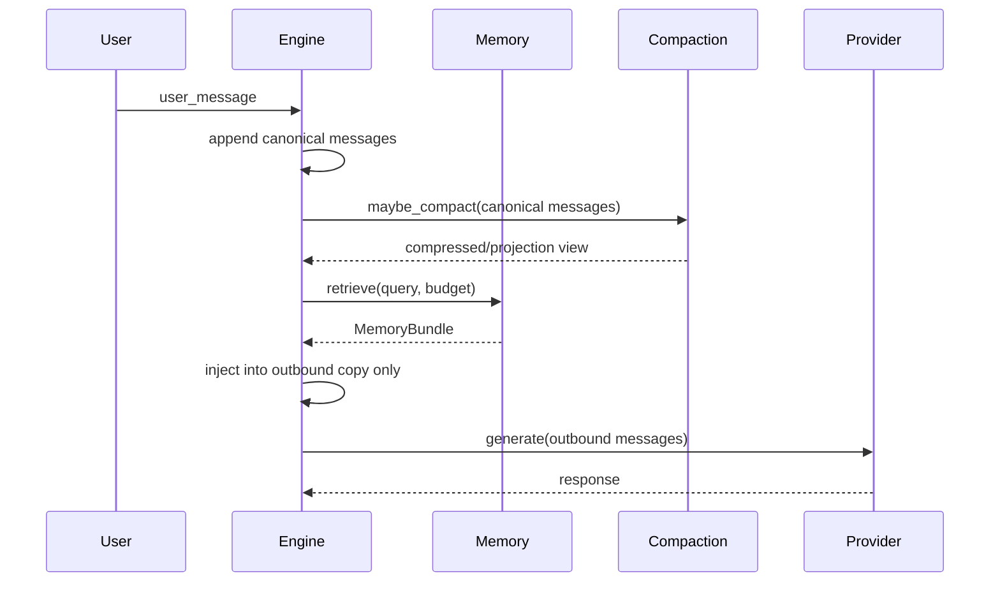

# Sprint 8 Memory 重实现总览

## 背景

当前 Aether 的 memory 模块还是占位接口：

```python
class MemoryProvider(ABC):
    @abstractmethod
    def build_context(self, session_id: str) -> str:
        raise NotImplementedError
```

这个接口过薄，无法表达以下关键语义：

- memory 来源是 session、task、project 还是 user profile。
- memory 是否可注入、注入多少、因为什么被跳过。
- memory 是否只是本次 provider payload 的 transient context。
- memory 如何与 compaction pipeline 解耦。
- memory provider 失败时如何降级。
- memory 写入是否需要用户授权、是否允许写个人长期画像。

Sprint 8 要把 Memory 变成一个稳定子系统，而不是在 prompt 前拼一段
字符串。

## 目标

1. 默认服务任务型 agent：跨 turn、跨 session 记住项目事实和任务状态。
2. 严格控制 token 成本：memory 只在相关时注入，且有硬预算。
3. 不破坏现有 compaction：memory 不进入 canonical transcript，也不被错误压缩进摘要。
4. 可审计：项目 memory 使用 markdown 文件，能 review、diff、手动修正。
5. 可降级：memory provider、索引、写入失败时主 loop 继续工作。
6. 保留未来 personal assistant 和 vector recall 的扩展位，但 Sprint 8 默认不启用。

## 非目标

- 不在 Sprint 8 引入 embeddings、Milvus、sqlite-vec 或其他 vector DB。
- 不做默认开启的个人长期用户画像。
- 不实现 claude-code 风格 autodream。相关机制延后到后续 sprint。
- 不把 memory 写入和 compaction summary 混为一体。
- 不让 memory 检索结果进入 session replay、trajectory content 或真实 transcript。

## 核心设计

### 三层 Memory

| 层 | Scope | 默认 | 说明 |
|---|---|---|---|
| Session/Task Memory | `session`, `task` | 开 | 当前任务目标、约束、决策、未完成事项 |
| Project Memory | `project` | 开 | 项目架构、约定、历史决策、常用路径 |
| Personal Memory | `user` | 关 | 用户长期偏好、个人画像、跨项目习惯 |

Sprint 8 的默认 `memory_mode="project"`，含义是启用 task + project，
但不启用 user profile。

### Canonical Transcript 与 Outbound Payload 分离

Aether 当前已经有两个重要边界：

- `HookOutcome.inject_user_context` 会对 outbound message copy 注入 context。
- compaction 的 projection view 可以只影响 provider payload，不改真实 messages。

Memory 必须沿用这个边界：



关键规则：

- canonical messages 只保存真实 user/assistant/tool 内容。
- retrieved memory 只进入本次 outbound payload。
- compaction 不消费 retrieved memory。
- turn-end reviewer 可以从真实 transcript 更新 task memory，但不能把“本次检索出来的 memory”反向写回。

## 与 Hermes / open-claude-code 的取舍

| 维度 | Hermes 倾向 | open-claude-code 倾向 | Aether Sprint 8 |
|---|---|---|---|
| Memory 形态 | provider/manager 后端服务 | markdown 文件 + prompt 注入 | 分层混合 |
| 注入时机 | query-time recall | 构造 prompt 时拼上下文 | query-time recall + outbound-only 注入 |
| 可审计性 | 依赖后端实现 | 文件可 diff | project memory 文件化 |
| 长期个人记忆 | 可作为 provider 能力 | 更偏项目/会话记忆 | 默认关闭 |
| 自动整理 | 可后台 sync | background extract/dream | Sprint 8 延后 |
| 稳定性策略 | provider 降级 | 文件简单可靠 | provider 失败不阻塞主 loop |

Aether 不直接照搬某一方。run-loop 层只定义稳定插槽和预算；memory
产品逻辑放到独立 provider/store/retriever 中。

## PR 拆分

| PR | 主题 | 主要产出 |
|---|---|---|
| PR 8.1 | Contracts + Config | Memory 数据模型、provider protocol、配置 |
| PR 8.2 | Ephemeral Injection | outbound-only 注入、metadata、compaction 边界 |
| PR 8.3 | Task/Session Memory | task snapshot、turn-end reviewer、pre-compact 更新 |
| PR 8.4 | Project Store | `.aether/memory` markdown store、index、原子写 |
| PR 8.5 | Retrieval + Budget | 无向量召回、排序、token packing、超时降级 |
| PR 8.6 | Tools + Write Policy | memory_read/write/update/forget/list 和权限策略 |
| PR 8.7 | Observability + Safety | 稳定 metadata、安全过滤、验收和回归测试 |

## 配置全景

| 字段 | 默认 | 说明 |
|---|---|---|
| `memory_enabled` | `True` | Memory 总开关 |
| `memory_mode` | `"project"` | `off/task/project/personal_assistant` |
| `memory_token_budget_pct` | `0.08` | 占模型窗口比例上限 |
| `memory_token_budget_max` | `2500` | 注入 token 硬上限 |
| `memory_block_token_max` | `500` | 单 block 上限 |
| `memory_retrieval_timeout_ms` | `200` | 检索等待上限 |
| `memory_project_store_enabled` | `True` | 是否启用项目 memory store |
| `memory_user_profile_enabled` | `False` | 是否启用 user memory |
| `memory_auto_write_enabled` | `False` | 是否允许自动写入 |
| `memory_llm_rerank_enabled` | `False` | 是否启用 LLM rerank |
| `memory_debug_log_content` | `False` | 是否在 debug 日志记录内容 |

## 注入优先级

1. task/session memory：当前目标、约束、决策、open questions。
2. project memory：项目事实、架构约定、相关路径和历史决策。
3. user memory：只有 personal assistant 模式才进入。

默认预算切分：

| scope | 预算 |
|---|---|
| task/session | 45% |
| project | 45% |
| user | 0% |
| reserve | 10% |

当 prompt 已接近 compaction 阈值时，memory budget 必须自动收缩；必要时直接跳过。

## 稳定性原则

- Memory 永远不能成为主 loop 的 hard dependency。
- provider 失败、索引损坏、文件锁失败、检索超时都必须返回 empty bundle。
- memory 写入失败不能污染 transcript。
- memory 结果必须带 provenance，模型能知道它来自哪里、可能过期。
- memory 内容默认不写入日志，避免泄漏。
- secret-like 内容不允许写入长期 memory。

## 完成定义

Sprint 8 完成时必须证明：

- task/project memory 默认可用，user profile 默认不可用。
- memory 注入只影响 outbound copy，不影响 session replay。
- compaction 前后 memory 行为稳定，不把 retrieved memory 压进摘要。
- 长上下文下 memory 能自动降级，避免额外触发 context overflow。
- project memory 可审计、可 diff、可恢复 corrupted index。
- 所有 memory provider 失败路径都被测试覆盖。

