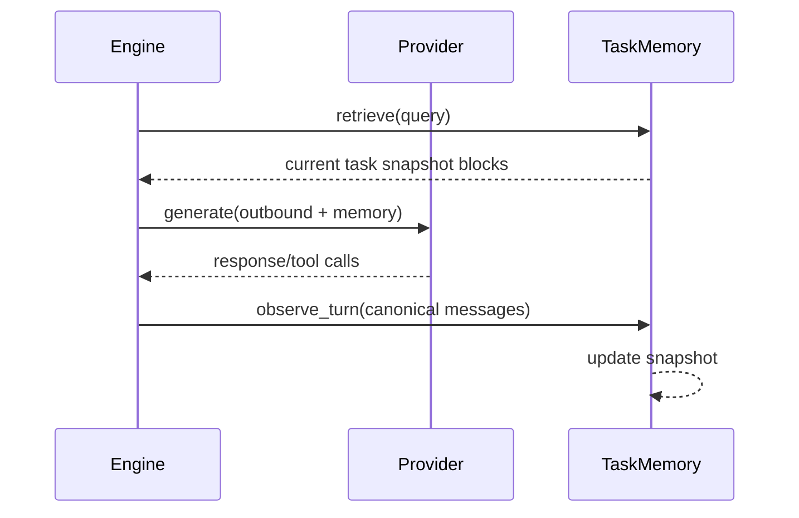

# PR 8.3 - Task / Session Memory

## 目标

实现默认开启的轻量任务记忆。它服务当前任务，不服务用户画像。

Task/session memory 应该回答：

- 当前任务目标是什么？
- 用户已经明确了哪些约束？
- 已经做过哪些关键决策？
- 哪些问题仍未解决？
- 最近工具调用发现了哪些仍然相关的事实？

## 新增/修改文件

| 文件 | 内容 |
|---|---|
| `backend/harness/aether/memory/task.py` | task memory snapshot、store、reviewer |
| `backend/harness/aether/runtime/session/session_runtime.py` | 挂载 task memory runtime state |
| `backend/harness/aether/agents/core/agent.py` | turn-end observe 和 before-compaction hook |
| `backend/harness/aether/tests/memory/test_task_memory.py` | task memory 测试 |

## 数据结构

```python
@dataclass(slots=True)
class TaskMemorySnapshot:
    session_id: str
    task_id: str | None
    goal: str | None = None
    constraints: list[str] = field(default_factory=list)
    decisions: list[str] = field(default_factory=list)
    open_questions: list[str] = field(default_factory=list)
    recent_findings: list[str] = field(default_factory=list)
    updated_at: str | None = None
    token_estimate: int = 0
```

## 生命周期



## 更新策略

首版使用本地启发式 + 可选 LLM reviewer：

| 信息 | 来源 | 默认方式 |
|---|---|---|
| goal | 最近 user message / explicit task metadata | 启发式 |
| constraints | 用户明确要求、权限/模式约束 | 启发式 |
| decisions | assistant final answer、明确“采用/决定”语句 | 启发式 |
| open questions | `AskUserQuestion` 或 assistant 明确阻塞点 | 启发式 |
| recent findings | tool results 摘要、文件路径、错误原因 | 启发式 |

LLM reviewer 可以后续加开关，但 PR 8.3 默认不依赖额外 LLM call。

## 与 Compaction 的关系

在 `_maybe_compact_messages()` 前可以调用：

```python
memory_provider.before_compaction(
    session_id=context.session_id,
    task_id=context.task_id,
    messages=messages,
    metadata=context.metadata,
)
```

允许行为：

- 用真实 messages 更新 task snapshot。
- 把长 recent findings 折叠成短摘要。

禁止行为：

- 修改 `messages`。
- 把 retrieved project/user memory 写入 task snapshot。
- 在 compaction 中额外注入 context。

## 注入优先级

Task memory 是最高优先级。预算不足时：

1. 保留 goal。
2. 保留最新 constraints。
3. 保留最新 decisions。
4. 保留 open questions。
5. 裁剪 recent findings。

## 过期与冲突

- 同一类事实出现冲突时，不静默覆盖，保留最新项并记录 source。
- 任务结束后 snapshot 可以保留到 session end，但默认不提升到 project memory。
- 只有明确用户指令或 memory_write 工具才能把 task decision 写入 project memory。

## 测试

```python
def test_task_snapshot_created_per_session(): ...
def test_task_memory_does_not_leak_between_sessions(): ...
def test_task_memory_extracts_explicit_constraints(): ...
def test_task_memory_prioritizes_goal_under_small_budget(): ...
def test_before_compaction_updates_snapshot_without_mutating_messages(): ...
def test_retrieved_project_memory_is_not_promoted_to_task_snapshot(): ...
def test_task_memory_observe_failure_does_not_fail_turn(): ...
```

## 验收门

- 多 session 并发不会串 memory。
- task memory 默认启用但 token 占用很小。
- compaction 前后 task memory 仍可用。
- task memory 不会自动写入长期 project/user store。
