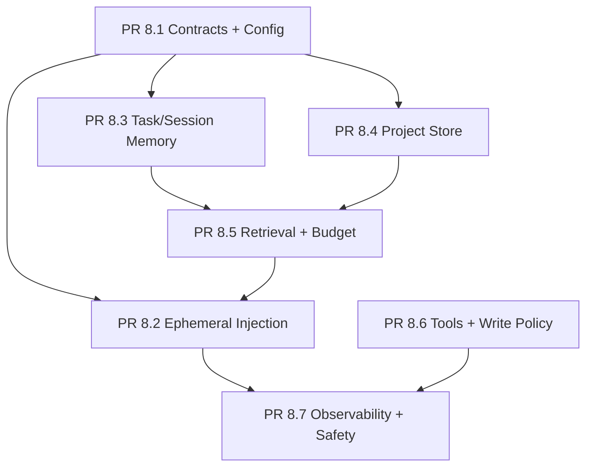

# Sprint 8 Memory Reimplementation

本目录定义 Aether Memory 重实现的 PR 级方案。

Sprint 8 的目标不是做一个简单的 `build_context(session_id) -> str`
薄封装，而是把 Memory 作为可审计、可控 token 成本、可降级的
run-loop 子系统来实现。默认服务“解决大任务的 agent”：记住当前
任务状态和项目约定，但不默认启用个人助手型长期画像。

## 文档索引

| 文档 | 内容 |
|---|---|
| [`00_overview.md`](./00_overview.md) | 总体设计、边界、PR 拆分和完成定义 |
| [`01_pr8_1_memory_contracts_and_config.md`](./01_pr8_1_memory_contracts_and_config.md) | Memory 契约、配置、数据模型 |
| [`02_pr8_2_ephemeral_context_injection.md`](./02_pr8_2_ephemeral_context_injection.md) | transient context 注入与压缩流水线边界 |
| [`03_pr8_3_task_session_memory.md`](./03_pr8_3_task_session_memory.md) | session/task memory 快照和任务状态维护 |
| [`04_pr8_4_project_memory_store.md`](./04_pr8_4_project_memory_store.md) | 项目级 markdown memory store |
| [`05_pr8_5_retrieval_ranking_and_budget.md`](./05_pr8_5_retrieval_ranking_and_budget.md) | 无向量检索、排序和 token 预算 |
| [`06_pr8_6_memory_tools_and_write_policy.md`](./06_pr8_6_memory_tools_and_write_policy.md) | memory 工具、写入策略、权限边界 |
| [`07_pr8_7_observability_and_safety.md`](./07_pr8_7_observability_and_safety.md) | 可观测性、安全、降级与稳定性 |
| [`99_acceptance_matrix.md`](./99_acceptance_matrix.md) | 全量验收矩阵 |

## 关键默认

| 决策 | 默认 |
|---|---|
| Memory 模式 | `project`，等价于 task + project memory |
| 个人长期记忆 | 默认关闭 |
| embeddings/vector DB | Sprint 8 不引入 |
| auto dream/autodream | 延后到后续 sprint |
| Memory 注入 | 只进入本次 provider outbound payload |
| 写入策略 | 默认显式写入，不静默沉淀用户画像 |
| token 上限 | 默认不超过上下文窗口 8%，且硬上限 2500 tokens |

## 实施顺序

