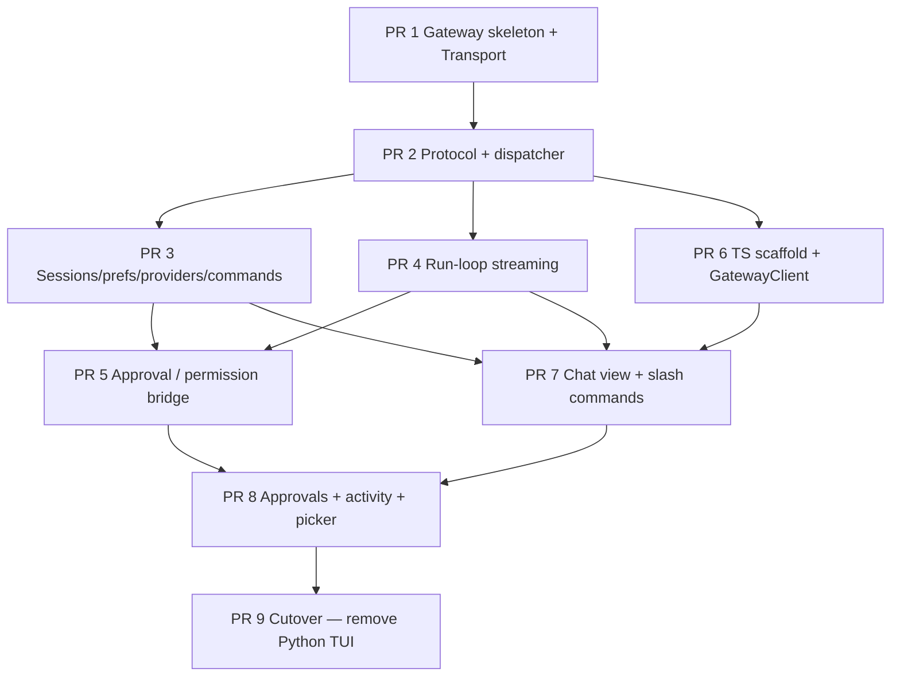

# TUI Split — Overview

## 背景

Aether 的 TUI 目前完全用 Python 写在 `aether/cli/`：长驻 `prompt_toolkit.Application`、`rich` 渲染、`asyncio.to_thread` 跑 engine，~8.2k LOC，依赖 `prompt_toolkit` 与 `rich`。

用户提出两个目标：

1. 把 TUI 重写成 TypeScript + Ink（React for terminals），换更好的组件生态。
2. 保留 Python 的 agent engine、memory、tools、providers、sessions，不重写后端。
3. 为未来 web UI 留接口：同一个 Python 后端、同一套方法、不同 transport。

CLI 当前耦合情况：

| 模块 | 性质 | 备注 |
|---|---|---|
| `aether/cli/main.py` | 入口 / argparse / 选 provider | console_scripts `aether = aether.cli.main:main` |
| `aether/cli/app.py` | 长驻 prompt_toolkit Application（~1160 LOC） | 纯 UI |
| `aether/cli/repl.py` | REPL 编排，把 engine + middleware 串起来 | 胶水 |
| `aether/cli/commands.py` | Slash 命令注册表（14 个命令） | 后端逻辑 |
| `aether/cli/sessions.py` | 会话持久化（`~/.aether/sessions/`） | 存储层 |
| `aether/cli/providers.py` | Provider 工厂 | 后端逻辑 |
| `aether/cli/prefs.py` | 模型偏好持久化 | 存储层 |
| `aether/cli/approval_prompter.py` | `Prompter` 协议（plan / question） | 协议 + UI |
| `aether/cli/tool_permission_prompter.py` | 工具权限确认的 async↔sync future 桥 | 关键胶水 |
| `aether/cli/ui.py` (~2400 LOC) | `rich.Live` 流式渲染、tool 面板、token 计数 | 纯 UI |
| `aether/cli/ui_middleware.py` | engine middleware → UI 事件 | 胶水 |
| `aether/cli/activity.py` | 活动条状态机（thinking / responding / tool-use） | 纯 UI |
| `aether/cli/theme.py` / `banner.py` / `picker.py` / `input_box.py` / `tool_groups.py` | 纯 UI 辅助 | 纯 UI |

外部代码**不** import `aether/cli/`。`aether/cli/` 与 backend 之间的天然契约是：

- `AgentEngine.run_loop(EngineRequest) -> EngineResult`（`aether/agents/core/agent.py:448`）
- `Prompter` 协议（`aether/cli/approval_prompter.py:38`）
- `ToolPermissionPrompter` 接口（`aether/cli/tool_permission_prompter.py`）
- Slash 命令注册表 + session/prefs/provider 函数

## 目标架构

```
┌──────────────────────────────────────────┐
│  aether-tui/  (TypeScript · Ink · React) │   Node 父进程，独占终端
│  src/entry.tsx → GatewayClient           │
│  src/components/* (Banner, Chat, ...)    │
│  src/store/* (nanostores)                │
└──────────────────┬───────────────────────┘
                   │ newline-delimited JSON-RPC over stdio
                   │ stderr → in-memory log ring
                   ▼
┌──────────────────────────────────────────┐
│  aether/gateway/  (Python)               │   子进程，由 TUI 拉起
│  entry.py       process bootstrap        │
│  transport.py   Transport protocol       │
│  dispatcher.py  @method registry + pool  │
│  handlers/      sessions, prefs, ...     │
└──────────────────┬───────────────────────┘
                   │ in-process import
                   ▼
       agents · memory · tools · runtime · providers
```

未来 web UI：保留同一个 `aether/gateway/` 包，新增 `WebSocketTransport` 实现 + 一个长驻 server entrypoint（`aether-gateway-server`）。`@method` handler 完全复用，dispatcher 不动。

## 参考实现

| 项目 | 价值 | 引用 |
|---|---|---|
| Hermes | 完整的 "TS Ink TUI + Python gateway over JSON-RPC stdio" 范式 | `/workspace/hermes-agent/{tui_gateway,ui-tui}` |
| open-claude-code | Ink + React 19 的组件写法、NDJSON 帧、transport 抽象 (Hybrid vs SSE) | `/workspace/open-claude-code/src/{components,cli/transports}` |

Hermes 的关键模式我们直接借用：

- `tui_gateway/transport.py` 的 `Transport` Protocol + `contextvars` 当前 transport
- `tui_gateway/server.py:137–169` 的 `@method("name")` 注册表 + `_LONG_HANDLERS` + `ThreadPoolExecutor`
- `tui_gateway/entry.py` 的 panic hook、SIGPIPE 处理、shutdown grace
- `ui-tui/src/gatewayClient.ts` 的子进程编排：startup timeout、日志环、stderr 捕获、pending request map、event buffer

open-claude-code 的可借鉴部分：

- `src/components/` 的 Ink 组件分层方式
- `src/cli/transports/` 的 transport 抽象（说明 v1→v2 替换可以做到 server-driven）

## 设计原则

- 后端只暴露行为，不暴露 UI。Python 端永远不依赖 `prompt_toolkit`、`rich`、终端尺寸。
- 协议先于代码：PR 2 定义完 JSON-RPC envelope + Pydantic 事件模型后再写 handler。
- `EngineRequest` / `EngineResult` / `LoopState` 等 runtime 契约**不**复制到 TS 侧，TS 只看 RPC 层的 schema。
- 流式事件走 JSON-RPC notification（无 id），需要 ack 的走 request（带 id + response）。
- 服务端发起的 RPC（approval / permission 询问）走 reverse-direction request，与正向请求共用 id 空间但走对侧 pending map。
- TS 类型先手写，不上代码生成。Hermes 在线上跑了 600+ 行手写类型也没出大问题，等 schema 稳定后再加 codegen。
- 进程生命周期要可控：panic hook、SIGPIPE handler、shutdown grace、stderr 捕获从第一天就铺好。

## PR 拆分与依赖



硬依赖：

| 依赖 | 原因 |
|---|---|
| PR 2 → PR 1 | dispatcher 用 transport 写帧 |
| PR 3, 4 → PR 2 | 都要往 `@method` 注册表挂 handler |
| PR 5 → PR 4 | approval 在 tool 调用前后发生，需要 run-loop 已经能 stream |
| PR 6 → PR 2 | TS 类型要镜像 Pydantic schema |
| PR 7 → PR 3, 4, 6 | chat 视图既要 chat 流也要 slash 命令 |
| PR 8 → PR 5, 7 | overlay 走 server-initiated RPC，且要叠在 chat 视图之上 |
| PR 9 → PR 8 | 切完前不能动 `aether/cli/` |

## 非目标

- 不在本次工作里实现 web UI。`WebSocketTransport` 接口预留，实现留给后续 PR。
- 不引入 codegen（Pydantic ↔ TS）。手写 + 单元测试覆盖 schema 漂移。
- 不重写 agent 内核。`AgentEngine.run_loop()` 签名与语义都不动。
- 不引入 gRPC / Protobuf / msgpack。stdio JSON-RPC 足够。
- 不做多窗口 / 多 session 并发 UI。第一版只支持一个活跃 session。
- 不实现 IDE 集成（VS Code extension 等）。

## 完成定义（Sprint）

- 所有 9 个 PR 合并。
- `aether` 命令在终端启动后是 TS Ink UI，看起来比当前 Python TUI 至少不差。
- 一个完整的 chat turn（含工具调用）能从 TS 端发出、Python 端跑通、事件流回 TS、消息渲染。
- approval 与 tool permission 弹窗在 TS 上工作；拒绝路径不会让 Python 进程挂死。
- session resume、`/model`、`/new`、`/clear` 等 slash 命令可用。
- `aether/cli/` 中纯 UI 文件被删除，`prompt_toolkit` 从 runtime 依赖中移除。
- 现有 backend 测试套件全绿。

## 术语

| 术语 | 含义 |
|---|---|
| Gateway | Python 端的 RPC server 进程，定义在 `aether/gateway/` |
| Transport | gateway 与对侧的字节通道，目前 stdio，未来 WebSocket |
| GatewayClient | TS 端的 gateway 进程管理器，定义在 `aether-tui/src/gatewayClient.ts` |
| Method | gateway 暴露的 RPC 方法名（`session.create`、`agent.run` 等） |
| Notification | JSON-RPC 中无 id 的单向事件（token delta、tool call 等） |
| Server-initiated request | gateway 主动向 TS 发的带 id 请求（approval 询问） |
| Long handler | 注册到 `_LONG_HANDLERS` 集合，被路由到 ThreadPoolExecutor 的 handler |
