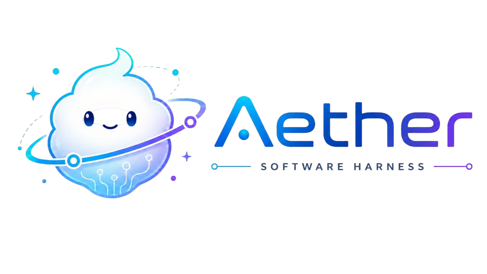

<p align="center">
  
</p>

# Aether Harness

Aether Harness is a lightweight agent runtime framework focused on provider abstraction, middleware pipelines, tool calling, and subagent orchestration.

## Project Layout

- `aether`: core runtime, providers, middleware, tools, and tests
- `docs/agent-engine`: design notes and enhancement docs
- `docker`: container deployment files

## Quick Start (Local)

1. Configure environment variables.
2. Sync the local environment.
3. Start the harness CLI.

```bash
cd /path/to/Aether
cp .env.example .env
uv sync
uv run aether
```

## Environment Variables (Example)

- `OPENAI_API_KEY`
- `OPENAI_BASE_URL`
- `AETHER_MODEL`
- `ANTHROPIC_API_KEY`
- `CODEX_ACCESS_TOKEN`

The local `.env` file is loaded automatically when the Aether package starts.

## Docker Compose

Ready-to-use deployment files are provided in `docker/` (`Dockerfile` + `docker-compose.yaml`).

```bash
cd docker
docker compose up -d
```

Open a shell in the running container:

```bash
docker compose exec aether-harness sh
```

Run test profile in container:

```bash
docker compose --profile tests run --rm aether-tests
```
